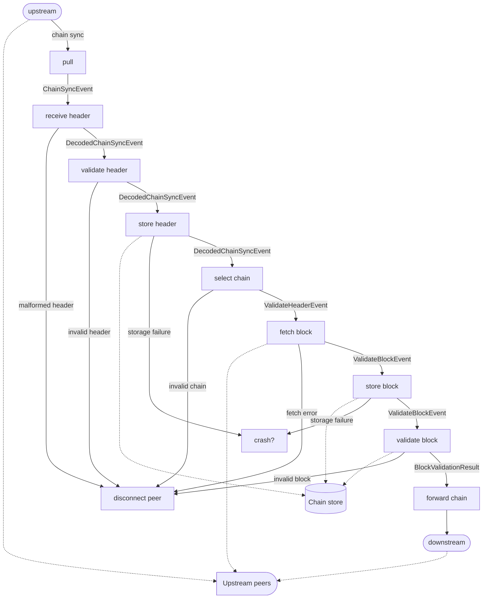

# Consensus pipeline

The following graph represents a simplified sequence of _stages_ headers (either forwarded or rolled-back) undergo in the consensus module. Each square node is a processing step, and arrows are labelled with the type of messages flowing between the various steps.

Stages:

* [pull](../amaru/src/stages/pull.rs): connects to upstream peers, running chain sync and block fetch protocols.
* [receive header](src/consensus/receive_header.rs): this stage is responsible for basic sanity check of _chain sync_ messages, deserialising raw headers, and potentially checking whether or not they should be further processed (eg. if a header is already known to be invalid, or known to be valid because it's part of our best chain, let's not waste time processing it!)
* [validate header](src/consensus/validate_header.rs): protocol validation of the header, checks the correctness of the VRF leader election w.r.t relevant stake distribution, and epoch nonce
* [store header](src/consensus/store_header.rs): store valid (and invalid?) headers indexed by hash
* [select chain](src/consensus/select_chain.rs): proceed to chain (candidate) selection, possibly changing the current best chain,
* [fetch block](../amaru/src/stages/consensus/fetch_block.rs): fetch block body corresponding to the new header, if any.
* [store block](src/consensus/store_block.rs): store valid (and invalid) block bodies, indexed by header hash. The blocks are stored _before_ validation in order to support [_pipelining_](https://iohk.io/en/blog/posts/2022/02/01/introducing-pipelining-cardanos-consensus-layer-scaling-solution/)
* [validate block](../amaru/src/stages/ledger.rs): validate the block body against its parent ledger state
* [forward chain](../amaru/src/stages/consensus/forward_chain/): forward newly selected chain to downstream peers (chain followers)
