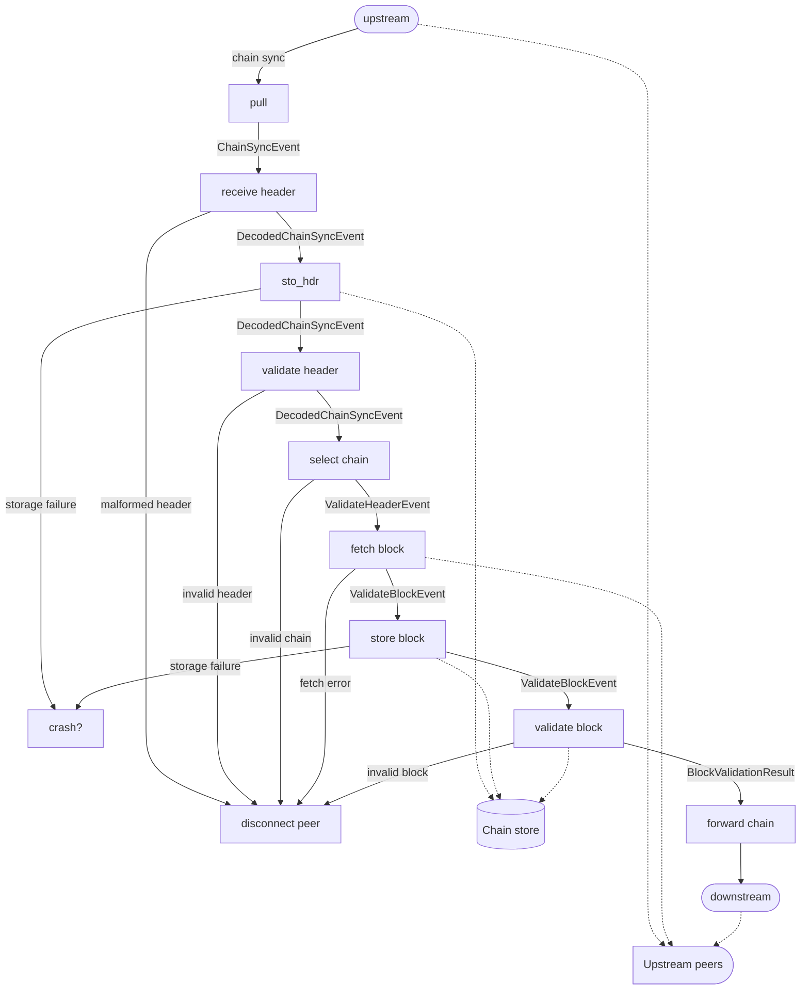

# Consensus pipeline

The following graph represents a simplified sequence of _stages_ headers (either forwarded or rolled-back) undergo in the consensus module. Each square node is a processing step, and arrows are labelled with the type of messages flowing between the various steps.


```mermaid
graph TD
    disc[disconnect peer]
    net@{ shape: delay, label: "Upstream peers" }
    upstream([upstream]) -.-> net
    upstream -- chain sync --> pull
    pull -- ChainSyncEvent --> rcv[receive header]
    rcv -- malformed header --> disc
    val_hdr[validate header]
    rcv -- DecodedChainSyncEvent --> sto_hdr
    sto_hdr -.-> store@{ shape: cyl, label: "Chain store" }
    sto_hdr -- storage failure --> crash?
    sto_hdr -- DecodedChainSyncEvent --> val_hdr[validate header]
    val_hdr -- invalid header --> disc
    val_hdr -- DecodedChainSyncEvent --> select[select chain]
    select -- invalid chain --> disc
    select -- ValidateHeaderEvent --> fetch[fetch block]
    fetch -.-> net
    fetch -- fetch error --> disc
    fetch -- ValidateBlockEvent --> sto_block[store block]
    sto_block -.-> store
    sto_block -- storage failure --> crash?
    sto_block -- ValidateBlockEvent --> val_block[validate block]
    val_block -.-> store
    val_block -- invalid block --> disc
    val_block -- BlockValidationResult --> fwd[forward chain]
    fwd --> down([downstream])
    down -.-> net
```

Stages:

* [pull](../amaru/src/stages/pull.rs): connects to upstream peers, running chain sync and block fetch protocols.
* [receive header](src/consensus/receive_header.rs): this stage is responsible for basic sanity check of _chain sync_ messages, deserialising raw headers, and potentially checking whether or not they should be further processed (eg. if a header is already known to be invalid, or known to be valid because it's part of our best chain, let's not waste time processing it!)
* [validate header](src/consensus/validate_header.rs): protocol validation of the header, checks the correctness of the VRF leader election w.r.t relevant stake distribution, and epoch nonce
* [store header](src/consensus/store_header.rs): store valid (and invalid?) headers indexed by hash
* [select chain](src/consensus/select_chain.rs): proceed to chain (candidate) selection, possibly changing the current best chain,
* [fetch block](../amaru/src/stages/consensus/fetch_block.rs): fetch block body corresponding to the new header, if any.
* [store block](src/consensus/store_block.rs): store valid (and invalid) block bodies, indexed by header hash. The blocks are stored _before_ validation in order to support [_pipelining_](https://iohk.io/en/blog/posts/2022/02/01/introducing-pipelining-cardanos-consensus-layer-scaling-solution/)
* [validate block](../amaru/src/stages/ledger.rs): validate the block body against its parent ledger state
* [forward chain](../amaru/src/stages/consensus/forward_chain/): forward newly selected chain to downstream peers (chain followers)

## Chain Selection

The main job of the _consensus_ component is to participate in the _Ouroboros consensus_ process, contributing to the validation (and as a block producer to the extension) of _the_ chain with _peers_ in an strongly connected network.
Being a _decentralized_ and _distributed_ system, there's no global information a peer can rely on, and therefore each has to decide on their own which chain to follow based on information provided by other peers. This is the _Chain Selection_ process:

* A node connects to a set of _upstream peers_ and starts running the `ChainSync` protocol client, pulling new headers starting from some well known intersection point and _tracking_ upstream peers' chain
* It validates the headers and corresponding bodies, discarding invalid ones and possibly disconnecting from incorrect peers,
* Given a set of valid _candidate chains_ the node tracks from its upstream peers, it selects its current _best chain_,
* As the best chain evolves, the node forwards changes to connected _downstream peers_ thus acting as an _upstream peer_ for them.

We specify here how this chain selection process is done, leaving aside network-related details, ie. how information flows from and to upstream and downstream peers, using some informal notation.

`chain_selection` can be thought as a function taking some `Upstream` message, current `State` and returning an updated `State` and a `Result`

```.haskell
chain_selection: Upstream -> State -> (State, Result)
```

`Upstream` messages are simple:

```.idris
data Upstream where
```

Either we receive a `RollForward` from some (upstream) `Peer`, telling us this peer has extended their current chain with the given `Header`.
This `Header` has already been validated by some earlier stage so it's internally consistent (eg. signature and VRF proof have been verified).

```.idris
    RollForward Peer Header
```

... or we receive a `Rollback`, telling us this peer has found a better fork and is now following it.

```.idris
  | Rollback Peer Point
```

The `State` we need to maintain and update is more complex:

```.idris
data State =  State {
```

It's conceptually split in two parts, an _immutable_ part which is stored on disk and is a single `Chain`, eg. a "list" of blocks where each block is valid and linked to its parent.
```
    immutable : Chain,
```

and a "volatile" or _mutable_ part which we call [`HeadersTree`](src/consensus/headers_tree.rs). It contains only headers as the blocks are always stored on disk and referenced by their header hash

```.idris
    headers_tree: HeadersTree
 }
```

This `HeadersTree` structure is:
  * a `tree` of _headers_ where the root is equal to the _tip_ of the `immutable` chain, with the property that a `Header` as a unique `NodeId` associated to it (e.g no two headers with the same `Hash` can ever be 2 nodes in the tree),
  * a map from `Peer`s to `NodeId` which tracks where (upstream) peers told us they are in the chain(s),
  * a singled out `best_chain` which points at _the_ node which is our current best chain, along with the `best_peer`,
  * a `max_length` parameter which is fixed at creation and is a bound on the maximum length of a branch of the `tree`.

```.idris
data HeadersTree = HeadersTree {
    tree :: Tree,
    peers: Map Peer NodeId,
    best_chain: NodeId,
    best_peer: Peer
 }
```

Here is a graphical representation of a `HeadersTree` with a couple of peers and a maximum length of 6:


