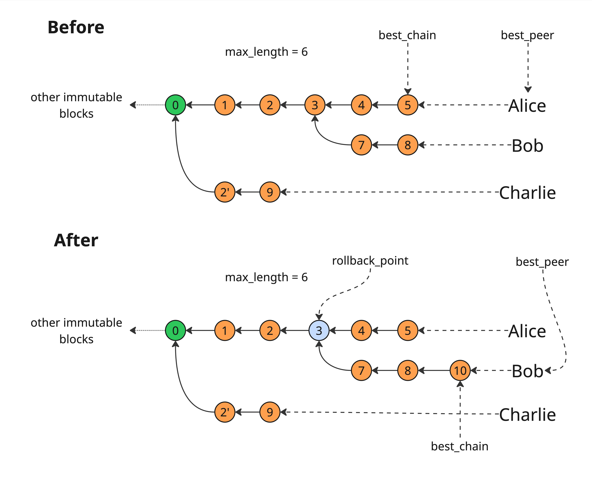

# Consensus pipeline

The following graph represents a simplified sequence of _stages_ headers (either forwarded or rolled-back) undergo in
the consensus module. Each square node is a processing step, and arrows are labelled with the type of messages flowing
between the various steps.


Stages:

* [pull](../amaru/src/stages/pull.rs): connects to upstream peers, running chain sync and block fetch protocols.
* [receive header](src/consensus/receive_header.rs): this stage is responsible for basic sanity check of _chain sync_
  messages, deserialising raw headers, and potentially checking whether or not they should be further processed (eg. if
  a header is already known to be invalid, or known to be valid because it's part of our best chain, let's not waste
  time processing it!)
* [validate header](src/consensus/validate_header.rs): protocol validation of the header, checks the correctness of the
  VRF leader election w.r.t relevant stake distribution, and epoch nonce
* [store header](src/consensus/store_header.rs): store valid (and invalid?) headers indexed by hash
* [select chain](src/consensus/select_chain.rs): proceed to chain (candidate) selection, possibly changing the current
  best chain,
* [fetch block](../amaru/src/stages/consensus/fetch_block.rs): fetch block body corresponding to the new header, if any.
* [store block](src/consensus/store_block.rs): store valid (and invalid) block bodies, indexed by header hash. The
  blocks are stored _before_ validation in order to support [
  _pipelining_](https://iohk.io/en/blog/posts/2022/02/01/introducing-pipelining-cardanos-consensus-layer-scaling-solution/)
* [validate block](../amaru/src/stages/ledger.rs): validate the block body against its parent ledger state
* [forward chain](../amaru/src/stages/consensus/forward_chain/): forward newly selected chain to downstream peers (chain
  followers)

## Chain Selection

The main job of the _consensus_ component is to participate in the _Ouroboros consensus_ process, contributing to the
validation (and as a block producer to the extension) of _the_ chain with _peers_ in a strongly connected network.
Being a _decentralized_ and _distributed_ system, there's no global information a peer can rely on, and therefore each
has to decide on their own which chain to follow based on information provided by other peers. This is the _Chain
Selection_ process:

* A node connects to a set of _upstream peers_ and starts running the `ChainSync` protocol client, pulling new headers
  starting from some well known intersection point and _tracking_ upstream peers' chain
* It validates the headers and corresponding bodies, discarding invalid ones and possibly disconnecting from incorrect
  peers,
* Given a set of valid _candidate chains_ the node tracks from its upstream peers, it selects its current _best chain_,
* As the best chain evolves, the node forwards changes to connected _downstream peers_ thus acting as an _upstream peer_
  for them.

We specify here how this chain selection process is done, leaving aside network-related details, ie. how information
flows from and to upstream and downstream peers, using some informal notation.

`chain_selection` can be thought of as a function taking some `Upstream` message, current `State` and returning an
updated
`State` and a `Result`

```.haskell
chain_selection: Upstream -> State -> (State, Result)
```

`Upstream` messages are simple:

```.idris
data Upstream where
```

Either we receive a `RollForward` from some (upstream) `Peer`, telling us this peer has extended their current chain
with the given `Header`.
This `Header` has already been validated by some earlier stage so it's internally consistent (eg. signature and VRF
proof have been verified).

```.idris
    RollForward Peer Header
```

... or we receive a `Rollback`, telling us this peer has found a better fork and is now following it.

```.idris
  | Rollback Peer Point
```

The `State` we need to maintain and update is more complex:

```.idris
data State =  State {
```

It's conceptually split in two parts, an _immutable_ part which is stored on disk and is a single `Chain`, eg. a "list"
of blocks where each block is valid and linked to its parent.

```haskell
    immutable : Chain,
```

and a "volatile" or _mutable_ part which we call [`HeadersTree`](src/consensus/headers_tree.rs). It contains only
headers as the blocks are always stored on disk and referenced by their header hash

```.idris
    headers_tree: HeadersTree
 }
```

This `HeadersTree` structure is:

* A `headers` map storing volatile headers by their hash. Since `Header`s specify a parent-child relationship, this is
  sufficient to reconstruct a tree of headers where the root of the tree is the tip of the `immutable` chain.
* A `parent_child_relationship` map of headers hashes to be able to traverse from root to leaves (for
  performance reasons).
* A `peers` map associating each `Peer` to the list of hashes forming the chain they are currently following.
* A singled out `best_chain` which points at _the_ header hash which is our current best chain.
* A `max_length` parameter, fixed at creation time, that bounds the maximum length of any branch of the `tree`.

```.idris
data HeadersTree = HeadersTree {
    headers :: Map HeaderHash Header,
    peers: Map Peer [HeaderHash],
    best_chain: HeaderHash,
    tree: Tree HeaderHash,
    max_length: Nat,
 }
```

Here is a graphical representation of a `HeadersTree` with a couple of peers and a maximum length of 6:


> [!IMPORTANT]
>
> Invariants for `HeadersTree` structure:
> * `best_chain`'s length is:
    >

* either exactly equal to `max_length`

> * or shorter than `max_length` and the root of the `tree` is `Genesis`
>

Finally, the `Result` of the chain selection algorithm defines what needs to be communicated to downstream `Peer`s:

```haskell
data Result =
```

* The simplest case is that our best chain did not change:

  ```haskell
  NoChange
  ```
* The chain could have been extended with a new header:

  ```haskell
  NewTip(Peer, Header)
  ```
* The chain has switched to a fork:
  ```haskell
  SwitchedToFork {
     peer: Peer,
     rollback_point : Point,
     fork: [Header]
  }
  ```

There are also a number of error conditions which are not formally specified but explained in
the [Handling errors](#handling-errors) section.

### Rolling forward

When a `RollForward peer header` message arrives, the peer tells us they are extending their chain by _one_ header. We
first check the given `header`'s parent: if it's not pointing at the header corresponding to what the `peers` map point
to, this is an error. If the header is well-formed, we need to identify several cases:

1. The message extends our current `best_chain`:
    * we insert the `header` into the map of `headers`,
    * we update the `peers` map to add a header hash to the `peer` current chain
    * the result of the selection is a `NewTip(peer, header)`,
2. The message comes from another `Peer`, which has several interesting subcases:
    1. The given `header` extends the `peer`'s chain but it's still shorter or of equal length than our `best_chain`: We
       simply add the new `header` to the `headers` map, update the `peers` map but do not change our `best_chain`. The
       result is `NoChange`,
    2. The given `header` extends the `peer`'s chain in such a way it becomes (strictly) _longer_ than our current
       `best_chain`:
        1. we update the map of `headers` to add the new `header`,
        2. we update the `peers` map to add the new header hash to the `peer`'s current chain,
        3. since the new `header` is now a different chain than the previous `best_chain`, we have a _fork_ and
           it [requires special care](#handling-forks).

If the `best_chain` has been extended or switched to, we must ensure that its length is always less than or equal to
`max_length`, so in "steady state" we must _prune_ the `headers` map (and corresponding `tree`).

The following diagram illustrates what can happen when pruning the map of headers.


In particular as shown here, it's possible for a `Peer` to point to a chain which is smaller than our `best_chain`
and anchored at the parent of our current tip (the root of the tree). In this case, there's no way this peer's
chain can ever become our best chain and we can as well drop this `Peer` altogether as it's obviously on a "dead"
fork.

### Rolling Backward

When a `Rollback peer point` message arrives, the peer notifies us they are switching to a fork. A rollback is most
often followed by roll-forwards providing the headers for the fork. Note a `Rollback` only contains a `Point` and not a
`Header`: We necessarily have the corresponding header as it was on the chain from this peer we previously followed.

The first step is to check whether or not the given `point` exists in our `tree`:

* If it does not then it's an error because:
    * either the pointed-at header is in the `immutable` part of the chain, and this is illegal,
    * or it's completely made up,
* If it does, then we need to update the content of the `HeadersTree`:
    * we update the `peers` map to truncate the list of header hashes for the `peer` which sent us the rollback message.
    * In addition, if the `peer` pointed to our current `best_chain`, this necessarily changes it with 2 different
      cases:
        * There's another peer pointing at a chain with the same length as the best chain before rollback: this is
          a [fork](#handling-forks), and we update our `best_chain` accordingly. The result of `chain_selection` is
          `SwitchToFork(peer, point, fork)`
          (the fork can possibly be empty if "another peer" actually the same peer because there is only one chain being
          tracked).
        * The rollback we received was in done in a context of a "switch to fork", with several `RollForward` coming-up
          that should end-up in a longer chain to switch to. We keep tracking the longest chain we know of with a
          pseudo-peer called `Me` and the result is `NoChange`,

### Handling forks

When we need to switch to another peer's chain that's not on our current `best_chain`, this is a fork. The following
picture represents a typical fork situation from a `Rollback "Alice" 4` message:



When a fork should happen:

1. We need to find the `rollback_point`, eg. the most recent intersection `Point` of the old and new `best_chain`s (node
   3 in the picture),
2. We update the `HeadersTree` so that:
    * The `peers` map for `peer` is so that its chain is truncated up to the rollback `point` hash (4 in the example),
    * Among the remaining peers having the longest chains, we pick the one where the tip has the smallest slot (let's
      call it `best_peer`).
    * `best_chain` points to this peer's chain,
3. We emit a `SwitchToFork` `Result`:
   ```haskell
   SwitchToFork {
      rollback_point,
      peer = best_peer,
      fork = [7, 8, 10]
   }
   ```

> [!WARNING]
>
> Currently, during a "switch to fork" we select the chain of the peer with the smallest tip slot among those with
> the longest chains, which is not fully deterministic if several peers tie.
>
>

### Handling errors
