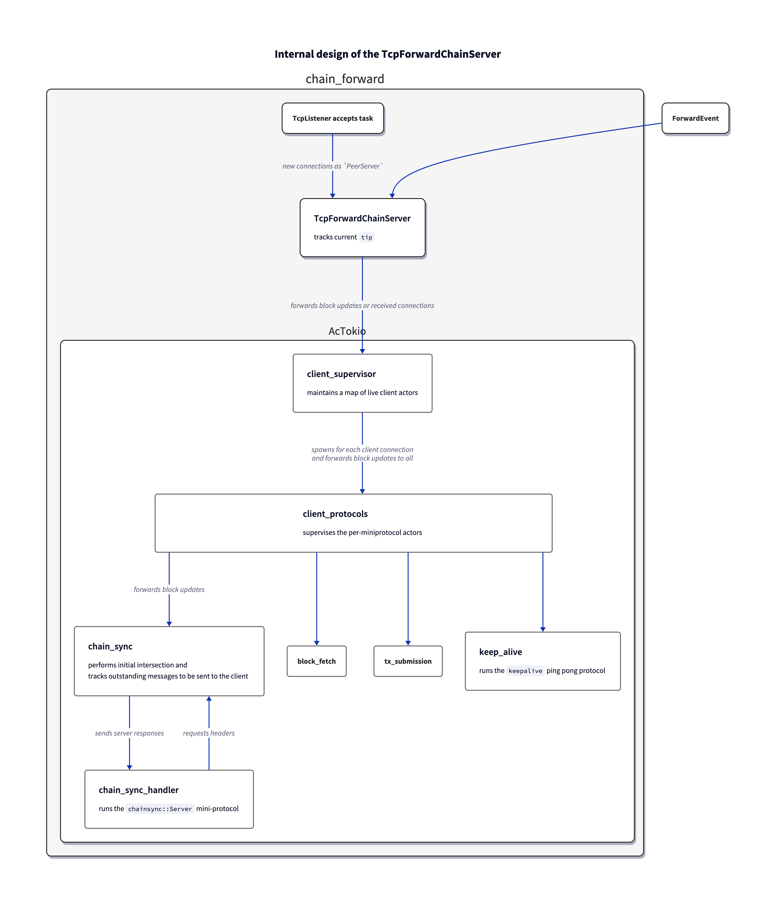

# chain_forward: Downstream Server

This stage needs to handle a high degree of concurrency due to

- getting block validation results
- receiving new client connections
- receiving various requests from those clients

Placing all these functions into one state machine is impractical due to the multiplicative state complexity explosion.
The current design therefore splits up the state into non-concurrent pieces and places each piece within an [`acto`](https://docs.rs/acto) actor.

## Accepting client connections

This functionality is given by the `PeerServer::accept` async function from Pallas, which in turn inherits its API design constraints from the Tokio [`TcpListener`](https://docs.rs/tokio/latest/tokio/net/struct.TcpListener.html).
Since its `accept` method borrows `self`, this async function cannot be spawned as a separate task, nor can its `Future` be stored within the `ForwardStage` without using `unsafe`; this API can only be used within another async function calling `accept` in a loop.
Therefore, such a task is spawned from the worker’s `bootstrap` hook and will send received connections to the worker via a bounded queue.

## Handling client requests

The `PeerServer` API bundles miniprotocol instances for each of the supported protocols, but unfortunately, using these instances via the `PeerServer` requires an exclusive reference, so the `PeerServer` needs to be deconstructed in order to allow concurrent usage of the protocols (like concurrently waiting for requests).
Each of the protocol instances is managed by one actor whose sole responsibility is to react to client requests as appropriate.
For `keepalive` this is trivial because no further information is needed to answer a request.
In the case of `chainsync` this actor needs to obtain information regarding the current best chain and consequently the list of outstanding header operations (roll forward or backward) in order to respond to requests for the next header.
Since it is impossible to await the next client request while staying responsive to incoming block validation updates, these two responsibilities need to be separated into two actors:

- `chain_sync` handles block validation updates and tracks them relative to the latest communicated state with the client
- `chain_sync_handler` handles client requests

Since `chain_sync` has no otherwise forbidding responsibilities, it stays responsive to requests from the `chain_sync_handler`.
This concurrency is the minimum required complexity to solve this problem, i.e. the split into these two actors should yield optimal readability and maintainability of the resulting code.
A further simplification of the communication between these two actors is achieved by performing the intersect part of the protocol — which must happen first — within the `chain_sync` actor before handing off the header requests part to the `chain_sync_handler`;
this is possible because I presume one intersection request to be a precondition for the first header request.

Between the level of per-protocol actors for one client and the overall client supervisor there is an additional level of per-client supervision in the `client_protocols` actors that serves to bundle the miniprotocols spoken over one client connection.
The effect is that failure in one protocol will tear down the others and the connection as well.
