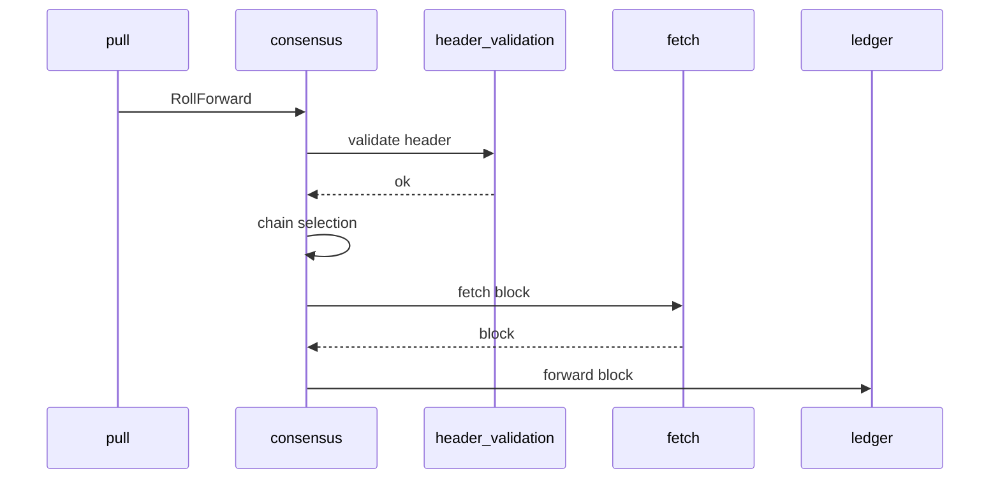
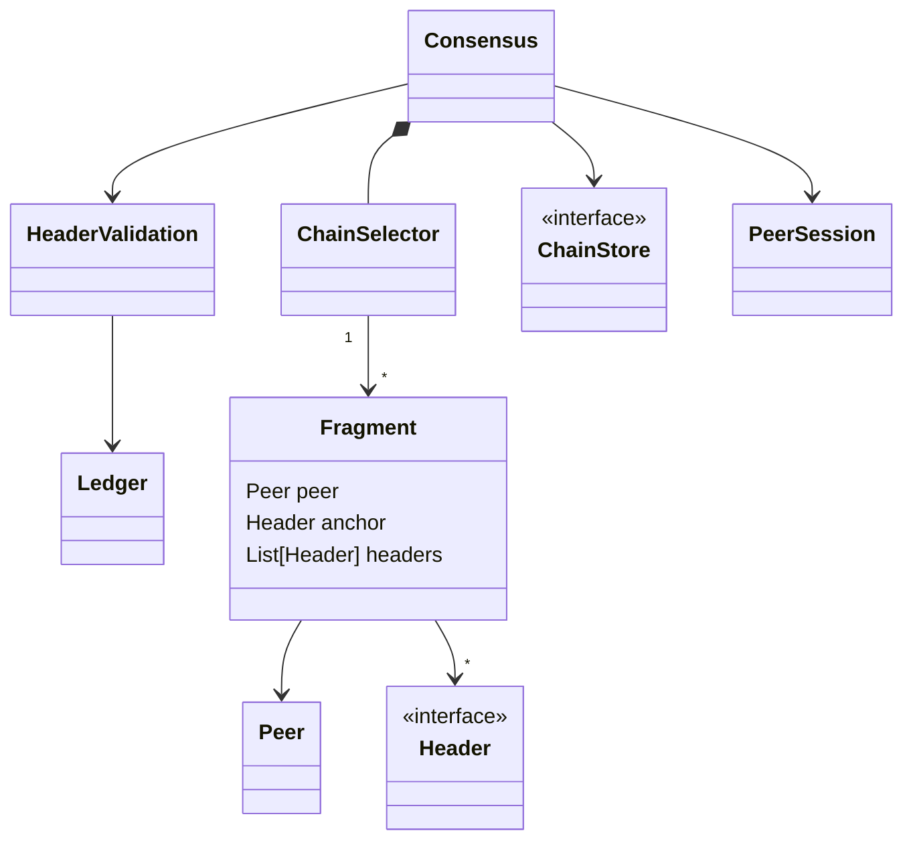

# Amaru Consensus

> [!WARNING]
> This is a work in progress and will be for the forthcoming months.
> This document will be revised and augmented on a regular basis and aims at
> providing a good summary of the current state of consensus.

This component aims at implementing Ouroboros Consensus, in Rust, within the Amaru node.

## Consensus design

Like the rest of Amaru, the consensus is structured as as [gasket](https://lib.rs/crates/gasket) stage leveraging Rust's asynchronous programming model and [tokio](https://lib.rs/crates/tokio) reference implementation. Conceptually, a gasket _Stage_ is part of pipeline that acts upon messages from an upstream component and sends messages to a downstream component.

Here is the current structure of pipeline for consensus, illustrated with simple example of a `RollForward` denoting a new header received from a peer:



The following diagram represents a simplified version of the various "objects" involved and their interactions:



### Limitations (2025-01-24)

There are a lot of limitations and missing features we'll need to address in the short-term. This is non exhaustive and just lists the most glaring ones.

* ChainDB is not part of chain selection logic which it should
* Node does not expose ChainSync so cannot be followed
* Chain DB does not store block bodies, which it should if it must serves BlockFetch
* Node is configured with a single peer, which obviously does not exert any kind of chain selection logic
* No validation is actually performed on the headers. It requires the nonce and accurate stake distribution we need to pull from the ledger, which we don't have yet.
* No considerations of security and adversarial behaviour from peers is being taken care of. This will require bi-directional interactions between the network and consensus layers in order to notify the former about misbehaviours and penalise those peers.
* BlockFetch logic and block validation is wrong
* Interface with the ledger needs to be revisited in order to minimise interactions: The header validaiton only needs stake distribution and updated nonces once per epoch
* ...

## Testing strategy

Ouroboros consensus is a somewhat complex and deceptive beast: While formulating its behaviour is relatively simple and straightforward, there are many corner cases and potential attack vectors one needs to guard against, therefore testing strategy needs to be an integral part of the design and development of a solution.

Furthermore, one of the goals of the Amaru projects is to document and generalise the behaviour of Cardano core components in order to ease comparisons, analysis, investigations, alternative implementations, benchmarks, tests,... without requiring retro-engineering an existing implementation.

The following picture summarizes core ideas of the current testing process for the consensus:


* The overall approach is _Model based_, using _State Machine_ models of the expected behaviour of interacting parts of the system to generate test traces and validate _SUT_'s behaviour
* A complete chain is generated, possibly with varying characteristics: length of tines, frequency of forks, distance between blocks, etc. This simulates how a node would see the chain progressing,
* The _Leader_ and _Observer_ are test-only components that are controlled by the _Test Driver_ through a "script" which basically defines their behaviour as a state machines (see below)
* The _Leader_ and the _SUT_ start at some random point in the generated chain,
* The _Observer_ plays the role of _downstream_ peers and collect `ChainSync` messages issued by the _SUT_
* The _Leader_, _SUT_ and _Observer_ are connected through direct channels, abstracting the details of low-level TCP connections, multiplexing, etc.
* The _Test Driver_ ensures the _SUT_ behaves according to the expectations, and can also drives the _Leader_ and _Observer_ to increase coverage, using _logs_ from the _SUT_

### Chain Sync specification

We would like to have a formal description of the protocol(s) that we can use to drive _Test doubles_. Here is a draft specification loosely based on [spex](https://spex-lang.org) language. Spex is currently very basic and does not allow for guarded transitions like the one we define below, so for the time being we could resort to "fake it" and have this state machine only in code.

```
-- Chain-sync node-to-node protocol

data Chain blk =
     Genesis
  |  Chain blk (Chain blk)

node Leader (chain : Chain a, tip : a) where

  StIdle & Follower?MsgDone & StDone

  StIdle & Follower?MsgFindIntersect(points)
     , [ points ∩ chain = {p,...} ] Follower!MsgIntersectFound(p, tip) & StIdle
     | [ points ∩ chain = ∅ ] Follower!MsgIntersectNotFound & StIdle

  StIdle & Follower?MsgRequestNext , Follower!MsgRollForward & StIdle
                                   | Follower!MsgRollBackward & StIdle
                                   | Follower!MsgAwaitReply & StMustReply

  StMustReply & Follower!MsgRollForward & StIdle
              | Follower!MsgRollBackward & StIdle

node Follower where

  StIdle & Leader!MsgDone & StDone

  StIdle & Leader!MsgFindIntersect , Leader?MsgIntersectFound & StIdle
                                   | Leader?MsgIntersectNotFound & StIdle

  StIdle & Leader!MsgRequestNext , Leader?MsgRollForward & StIdle
                                 | Leader?MsgRollBackward & StIdle
                                 | Leader?MsgAwaitReply & StMustReply

  StMustReply & Leader?MsgRollForward & StIdle
              | Leader?MsgRollBackward & StIdle
```

## References

* [Cardano Consensus and Storage Layer](https://ouroboros-consensus.cardano.intersectmbo.org/assets/files/report-b72e7d765cfee85b26dc035c52c6de84.pdf)
* [Ouroboros Network Specification](https://ouroboros-network.cardano.intersectmbo.org/pdfs/network-spec/network-spec.pdf)
