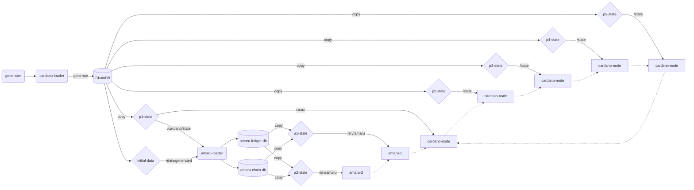

# Amaru Testnet

>
> This is extremely rough on the edges and brittle. Most notably, the
> configuration of the network is fixed (5 block producers, epoch
> length of 86400 slots, k=432, etc.). While it's possible to generate
> and run arbitrary testnets this is not covered here yet.
>
> Moreover it depends on various tools and fork of tools whose
> maintainability in the long run is not guaranteed:
>
> * [db-server](https://github.com/pragma-org/db-server) which is a
>   tool to query a cardano-node chain database
> * A fork at a version compatible with node 10.1.4 [db-synthesizer](https://github.com/abailly/ouroboros-consensus/tree/abailly/snapshot-generator)

This docker compose stack is meant to spawn a self-contained testnet comprised of:

* 5 block producing cardano-nodes,
* and 2 amaru nodes.

The topology of the testnet is currently fixed:

* Each cardano-node `pN` is connected to cardano-node `p[N-1]` and `p[N+1]`
* amaru node `1` is connected to `p1`,
* amaru node `2` is connected to `p2`.

## Usage

### Build

Build the _Generator_ image which contains Tools in Haskell to work with the ChainDB (takes a while):

```
docker build -t ghcr.io/pragma-org/amaru/generator:latest -f Dockerfile.generator .
```

Build an up-to-date version of Amaru (might take a while):

```
docker build -t ghcr.io/pragma-org/amaru/amaru:latest -f ../Dockerfile.amaru ../..
```

Build the compose stack (should be fast if the images are available):

```
INTERNAL_NETWORK=false docker compose build
```

**NOTE**: The `INTERNAL_NETWORK` variable will be needed when running inside [Antithesis](https://github.com/cardano-foundation/antithesis).

### Run

To start the network in the terminal (add `-d` to detach as usual, takes a few minutes as it needs to generate databases):

```
INTERNAL_NETWORK=false docker compose up
```

If things go well, you should start seeing logs from all the nodes, Amaru and cardano-node alike, when a new tip is adopted.

There are a myriad ways in which this can go wrong so feel free to reach out to the discord server and ask for help.

To stop the network:

```
INTERNAL_NETWORK=false docker compose down
```

The stack creates a number of persistent volumes, if you want to
restart from scratch, make sure the volumes are all deleted.

## How it works?

In a nutshell, the process to spin-up such a testnet involves the following steps:

1. Generate configuration, genesis, and keys: this step is not covered here as we reuse `p1-config` to `p5-config` pre-generated configurations. The CF has developed a [tool](https://github.com/cardano-foundation/testnet-generation-tool) for that purpose which is what has been used to generate those configurations,
2. Generate a chain database spanning several epochs: this step is needed because Amaru was never intended to be able to synchronize a chain from _Genesis_ as this would require reimplementing a lot of obsolete logic which does not make much sense. Instead it can _bootstrap_ itself given a few key elements about the chain. We therefore need to "prime" the cardano-nodes with a valid chain that contains enough data for bootstrapping Amaru
3. Generate bootstrap data from database generated at step 2: as mentioned, Amaru needs some elements to boostrap: ledger state snapshots, nonces, and a few headers. Those elements are provided out-of-the-box for well-known networks (eg. `preview`, `preprod` and `mainnet`) but not for arbitrary networks (eg. `testnets`), so we need to generate them from the generated database,
4. Start cardano-node nodes: The nodes will revalidate their database upon startup which should be fast as a testnet database is small and then start accepting connections and minting blocks,
5. Start amaru nodes: amaru nodes cannot start without an upstream peer, so they will wait for their peer to become available and then start synchronising their local chains.

This process is encapsulated in the [cardano-loader.sh](./cardano-loader.sh) and [amaru-loader.sh](./amaru-loader.sh) scripts.

### Data generation flow

The following diagram details how data is generated and flows to the various containers of the cluster.

* losanges are docker volumes
* rounded rectangles are configuration services
* rectangles are nodes (both amaru and cardano-node BPs)
* dotted lines are runtime network connections between nodes



> [!WARNING]
> If you get validation or boostrap errors while trying to run the cluster, make sure no stale volumes are kept around.
> By default `docker-compose down` won't remove the named volumes and one needs to explicitly delete them.
