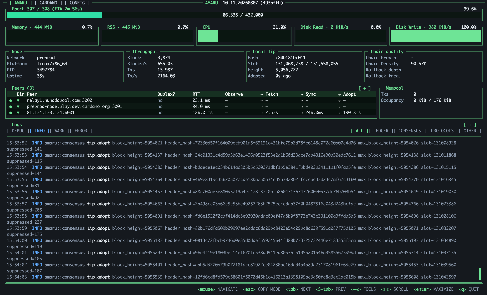

This is the fast path to a synced Amaru node: install the binary, bootstrap from a snapshot, and start it on `preprod`.

## 1. Hardware requirements

| Network | CPU Cores | Free RAM | Free storage |
|:-------:| :---: |:--------:|:------------:|
| Mainnet | 2 |   4GB    |     30GB     |
| Preprod | 2 |   2GB    |     10GB     |

:::note
The Amaru process should not exceed 1 GB of RSS memory under standard conditions. Allocating 4GB of RAM provides sufficient headroom for the process to handle the load associated with mainnet stress.
:::

## 2. Installing Amaru

:::info version reference
Amaru releases follow a calendar-based scheme (e.g. `10.11.20260827`). Always check the [releases page](https://github.com/pragma-org/amaru/releases) for the latest version before installing. Amaru is still in an exploratory phase, so expect frequent releases and occasional breaking changes.
:::

Pick whichever method fits your environment:

<details>
<summary><strong>Release Binaries</strong> — pre-compiled executables</summary>

Statically-linked executables for Linux, macOS, and Windows, with shell completion scripts, are attached to every [release](https://github.com/pragma-org/amaru/releases) and [nightly build](https://pragma-org.github.io/amaru/). Download the archive for your platform and put the `amaru` binary on your `$PATH`.

</details>

<details>
<summary><strong>Debian / RPM package</strong> — create amaru user and systemd service</summary>

Also installs a dedicated system user and a systemd service, it's the recommended path for a production deployment; see [Installing Amaru](05-amaru-advanced-installation.md#1-installing-amaru-as-a-systemd-service) in the mainnet guide.

**Debian/Ubuntu:**
```bash
VERSION=10.11.20260827 ARCH=x86_64  # check releases page for latest; also available for aarch64
curl -fsSL -o amaru-$VERSION-linux-$ARCH.deb "https://github.com/pragma-org/amaru/releases/download/v$VERSION/amaru-$VERSION-linux-$ARCH.deb"
sudo apt install ./amaru-$VERSION-linux-$ARCH.deb
```

**Fedora/RHEL/CentOS:**
```bash
VERSION=10.11.20260827 ARCH=x86_64  # check releases page for latest; also available for aarch64
curl -fsSL -o amaru-$VERSION-linux-$ARCH.rpm "https://github.com/pragma-org/amaru/releases/download/v$VERSION/amaru-$VERSION-linux-$ARCH.rpm"
sudo dnf install ./amaru-$VERSION-linux-$ARCH.rpm
```

</details>

<details>
<summary><strong>Docker image</strong></summary>

```bash
docker pull ghcr.io/pragma-org/amaru:latest
```

Multi-arch (amd64/arm64), published on every change to `main` (`:latest`, a nightly build) and for tagged releases. See the [package page](https://github.com/pragma-org/amaru/pkgs/container/amaru) for all tags.

</details>

<details>
<summary><strong>Homebrew</strong> (macOS & Linux)</summary>

```bash
brew tap pragma-org/amaru https://github.com/pragma-org/amaru && brew trust --tap pragma-org/amaru
brew install amaru
```

</details>

<details>
<summary><strong>Nix</strong> (macOS & Linux)</summary>

```bash
nix profile install --no-write-lock-file github:pragma-org/amaru#amaru
```

</details>

<details>
<summary><strong>Build from source</strong></summary>

Install a Rust toolchain (edition 2024, Rust 1.97 or newer, see [rustup](https://rustup.rs)), then from a clone of the [amaru repository](https://github.com/pragma-org/amaru):

```bash
cargo build --release
```

The binary is produced at `target/release/amaru`. Amaru also provides a Docker-based build and run path, see [docker/README.md](https://github.com/pragma-org/amaru/blob/main/docker/README.md) in the repository.

</details>

## 3. Bootstrapping the node

Create a directory for your chosen network :

```bash
mkdir -p $HOME/amaru/preprod/
cd $HOME/amaru/preprod
```

Amaru bootstraps itself with Mithril-derived snapshots :

```bash
amaru node bootstrap --network preprod
```

This downloads a window of pre-generated Mithril-derived ledger snapshots from Amaru's snapshot bucket and imports them directly into the chain and ledger databases.
`amaru node run` then only needs to sync the blocks produced since then.
```bash
$HOME/amaru/preprod/
├── chain.preprod.db/
├── ledger.preprod.db/
└── snapshots/
```
:::note
Bootstrap fails if the target directories (chain or ledger) already contain data, remove them first before re-bootstrapping:
`amaru node rm --wipe-all-dbs --network preprod` or `rm -rf chain.preprod.db/ ledger.preprod.db/`
:::

## 4. Running the node

:::info
Amaru ships with the genesis files and protocol parameters for `mainnet`, `preprod`, and `preview` compiled into the binary, there is nothing to download. Just pass `--network` when starting the node.

For a custom network (`testnet_<magic>`), pass a JSON [era history file](https://github.com/pragma-org/amaru/blob/main/crates/amaru-kernel/src/cardano/snapshots/amaru_kernel__cardano__era_history__tests__mainnet_era_history.snap) with `--era-history` and override the global parameters (security parameter, epoch length, etc.) with the corresponding flags, see [Configuring the node](05-amaru-advanced-installation.md#3-configuring-the-node) in the mainnet guide, or run `amaru node run --help-global-parameters` for the full list.
:::

```bash
amaru node run --network preprod
```

| Flag | Description                                                                       |
|------|-----------------------------------------------------------------------------------|
| `--network` | Network to run on: `mainnet`, `preprod`, `preview`, or a custom `testnet_<magic>` |
| `--chain-dir` | Directory for the chain database (defaults to `./chain.<network>.db`)             |
| `--ledger-dir` | Directory for the ledger database (defaults to `./ledger.<network>.db`)           |
| `--listen-address` | Address to accept incoming peer connections on (default `0.0.0.0:3000`)           |
| `--peer-address` | Upstream peer(s) to sync from; repeatable or comma-separated                      |
| `--upstream-peers` | Maximum number of upstream (outbound) peers Amaru maintains at once (default `3`) |
| `--submit-api-address` | If set, exposes an HTTP `POST /api/submit/tx` endpoint for transaction submission |

For the full list of options run `amaru node run --help`.

Unless `--no-tui` is passed (or stdout isn't a terminal), `amaru node run` opens an embedded terminal dashboard showing sync progress, peers, and logs live, that's the quickest way to confirm the node is catching up to the tip. See [The Amaru TUI](02-amaru-tui.md) for a full tour of what it shows.




:::important
As with cardano-node, do not treat the node as caught up, or submit transactions, until the tip shown matches the current chain tip on a public explorer.
:::

For OpenTelemetry metrics/logs/traces, Monitoring dashboards, submitting transactions, upgrading, and other operational details, see [Advanced Installation](05-amaru-advanced-installation.md) in the mainnet guide.
