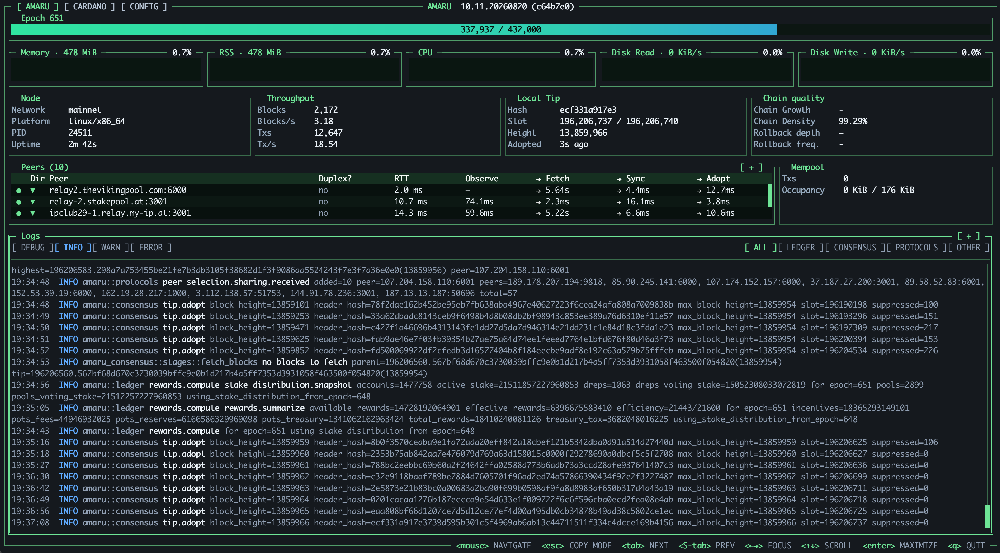
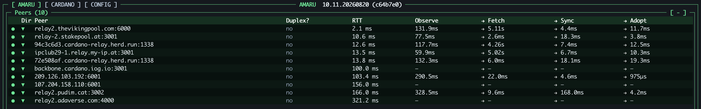
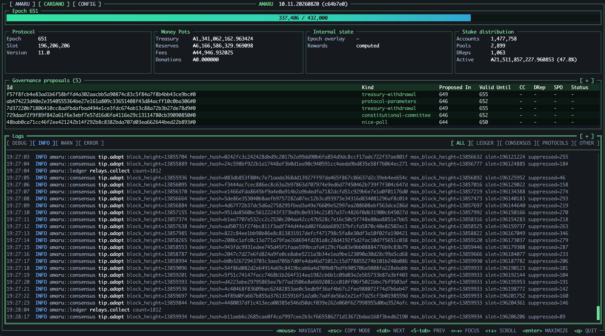
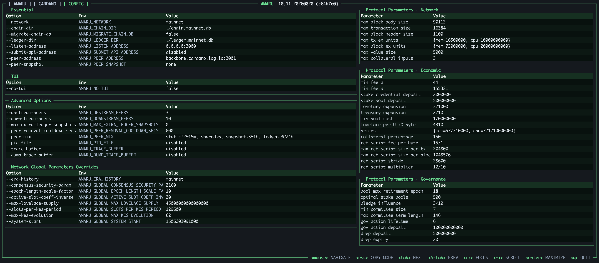

When using `amaru node run`, it opens an embedded terminal dashboard live in your shell. It's the quickest way to see whether the node is syncing, how it's performing, and what it's doing right now.

## Tabs

The top bar switches between three views: **AMARU**, **CARDANO**, and **CONFIG**, described below.  
The node's version and commit hash (e.g. `10.11.20260807 (493bffb)`) are always shown top-center.

## AMARU tab

Shown by default when the TUI opens: node-process health, networking, and consensus; sync progress, resource usage, peers, and logs.

*Amaru TUI Syncing on Preprod*

### Sync progress

While syncing, the top bar tracks progress through the current epoch: epoch number (307 / 308), ETA to the end of sync (2m56s), slots processed within the epoch (86,338 / 432,000), and overall sync percentage (99.6%).  
When the sync is over the ETA and Percentage will disappear.

*Amaru TUI Running on Mainnet*

### Resource gauges

Live gauges for **Memory**, **RSS**, **CPU**, **Disk Read**, and **Disk Write**, each with a percentage relative to a reference ceiling.  
**Memory** is the amount allocated to the process, while **RSS** (Resident Set Size) is the portion of that actually resident in RAM, the number to watch if you're worried about the host running out of memory.

### Peers

One row per connected peer: connection **Dir**ection (inbound/outbound), peer address, **Duplex** (whether the connection carries traffic in both directions at once, rather than one-way), **RTT** (round-trip latency to the peer), and per-stage latency.  
(see [openBlockPerf](https://developers.cardano.org/docs/operators/monitoring/monitoring-openblockperf/)) :  
- **Observe** : Time until a relay node first hears about the new block header.
- **Fetch** : Time while the relay node requests the block body from peers.  
- **Sync** : Time until the block body download completes.
- **Adopt** : Time until the local node validates and adopts the block.

The `[ + ]` in the top-right lets you expand the panel to see all connected peers.  
If a peer shows a red dot instead of a green one, it means it has not responded for some time and will soon be evicted.

### Mempool

Pending transaction count (**Txs**) and current **Occupancy**: how much of the mempool's size budget (in KiB) is filled with transactions waiting to be included in an upcoming block.

### Logs

A live, filterable log tail. Filter by level (**DEBUG**, **INFO**, **WARN**, **ERROR**) and by component (**ALL**, **LEDGER**, **CONSENSUS**, **PROTOCOLS**, **OTHER**) using the toggles above the log pane.

## CARDANO tab

Shows on-chain governance state, reward pots, stake distribution, and governance proposals in flight.

For the time being, the view is purely informative; other elements could be added in the future.

## CONFIG tab

The full list of CLI flags, their matching `AMARU_*` environment variables, and their current value (see [Configuring the node](05-amaru-advanced-installation.md#3-configuring-the-node)).  
We also see protocol parameters and network global parameters used by Amaru.

## Keybindings

These apply across all three tabs:

| Key | Action                                                                |
|-----|-----------------------------------------------------------------------|
| Mouse | Navigate between panels                                               |
| `Esc` | Enter copy mode (enables cursor selection, e.g. to copy config values) |
| `Tab` / `Shift+Tab` | Focus next / previous panel                                           |
| `←` `→` | Move focus within a panel                                             |
| `↑` `↓` | Scroll the focused panel                                              |
| `Enter` | Maximize the focused panel                                            |
| `q` | Quit – note: no confirmation prompt.                                  |
