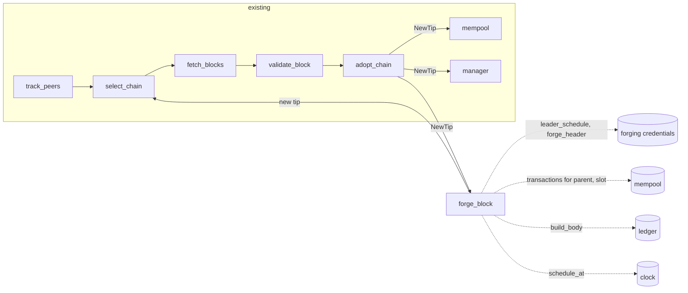

# Block Forging

Currently, Amaru follows the chain but does not extend it. This document describes how a stake pool running Amaru would produce blocks.
The goal is a valid block with limited wasted work. The Haskell node is our reference for what "valid" means, and this document links to the relevant code, but the shape of our implementation is our own.

## Context

### Slot leadership is decided before the epoch starts

A pool leads a slot when its VRF output for that slot, hashed with the epoch nonce, falls below a threshold that depends only on its stake share and the active slot coefficient `f`. See the Praos paper ([eprint 2017/573](https://eprint.iacr.org/2017/573)) for the protocol, and [`checkLeaderValue`](https://github.com/IntersectMBO/cardano-ledger/blob/bc7df956110912d3b1e3501dbb66e466f7220398/libs/cardano-protocol/src/Cardano/Protocol/TPraos/BlockHeader.hs#L337-L371) for the check as implemented.The VRF input is `hash(slot ‖ epoch nonce)` ([`mkInputVRF`](https://github.com/IntersectMBO/cardano-ledger/blob/bc7df956110912d3b1e3501dbb66e466f7220398/libs/cardano-protocol/src/Cardano/Protocol/Praos/VRF.hs#L63-L78)).

Every input to that check is fixed before the epoch starts. The stake share comes from the snapshot taken two epochs earlier, which Amaru already exposes through `PoolSummaries`.The epoch nonce is fixed two days before the boundary (next section). So a pool could compute its whole leader schedule for an epoch in one pass. On mainnet that is 432,000 VRF evaluations.

The Haskell node does not do this. Its forging loop wakes on every slot and evaluates the VRF each time ([`forkBlockForging`](https://github.com/IntersectMBO/ouroboros-consensus/blob/0ce94ef215312633d44d049ea1a7e30eb4b3deb6/ouroboros-consensus-diffusion/src/ouroboros-consensus-diffusion/Ouroboros/Consensus/NodeKernel.hs#L549-L573), then [`checkIsLeader`](https://github.com/IntersectMBO/ouroboros-consensus/blob/0ce94ef215312633d44d049ea1a7e30eb4b3deb6/ouroboros-consensus-protocol/src/ouroboros-consensus-protocol/Ouroboros/Consensus/Protocol/Praos.hs#L408-L428)).

### The epoch nonce and the stability window

A header carries its VRF output, from which each node derives three nonces, **active**, **evolving** and **candidate**. Amaru does this in `evolve_nonce` and stores the result in the chain store keyed by header hash, as [`Nonces`](../crates/amaru-ouroboros-traits/src/praos/nonces.rs). The Haskell equivalents are the fields of [`PraosState`](https://github.com/IntersectMBO/ouroboros-consensus/blob/0ce94ef215312633d44d049ea1a7e30eb4b3deb6/ouroboros-consensus-protocol/src/ouroboros-consensus-protocol/Ouroboros/Consensus/Protocol/Praos.hs#L270-L290).

- The **active** nonce is the one this epoch's leader checks use.
- The **evolving** nonce is a running hash that every block folds its VRF output into.
- The **candidate** nonce is a copy of the evolving nonce that stops updating once a block's slot is within the randomness stabilisation window of the next epoch, `4k/f` slots.
  See the freeze in [`reupdateChainDepState`](https://github.com/IntersectMBO/ouroboros-consensus/blob/0ce94ef215312633d44d049ea1a7e30eb4b3deb6/ouroboros-consensus-protocol/src/ouroboros-consensus-protocol/Ouroboros/Consensus/Protocol/Praos.hs#L518-L521) and Amaru's [`randomness_stability_window`](../crates/amaru-ouroboros/src/praos/nonce.rs).

At the epoch boundary, the new active nonce is the hash of the frozen candidate and a header hash from the tail of the previous epoch ([Haskell](https://github.com/IntersectMBO/ouroboros-consensus/blob/0ce94ef215312633d44d049ea1a7e30eb4b3deb6/ouroboros-consensus-protocol/src/ouroboros-consensus-protocol/Ouroboros/Consensus/Protocol/Praos.hs#L442-L468), Amaru's `Nonces::next_active`). The freeze exists so that the last blocks of an epoch cannot grind the next nonce. For us it has a second use: from the first block adopted inside the window, the next epoch's nonce is known, and thus so is our schedule.

### Keys

There are four keys used in the forging process. The Haskell node reads them in [`readLeaderCredentials`](https://github.com/IntersectMBO/cardano-node/blob/a38eac60bceb1a64a4ffa29e2d49d802787ce171/cardano-node/src/Cardano/Node/Protocol/Shelley.hs#L161-L211) and bundles them as [`PraosCanBeLeader`](https://github.com/IntersectMBO/ouroboros-consensus/blob/0ce94ef215312633d44d049ea1a7e30eb4b3deb6/ouroboros-consensus-protocol/src/ouroboros-consensus-protocol/Ouroboros/Consensus/Protocol/Praos/Common.hs#L272-L297).

- The **cold key** is an Ed25519 key kept offline. Its hash is the pool id. It signs the pool registration certificate and the operational certificate. The running node only needs the assosciated public key.
- The **VRF key** lives on the block producer. It proves slot leadership. Cardano uses ECVRF-Ed25519-SHA512-Elligator2 from [draft-irtf-cfrg-vrf-03](https://datatracker.ietf.org/doc/html/draft-irtf-cfrg-vrf-03), bound in [`Cardano.Crypto.VRF.Praos`](https://github.com/IntersectMBO/cardano-base/blob/d92e2e3841eaad354c5e1ef77b458b347f471271/cardano-crypto-praos/src/Cardano/Crypto/VRF/Praos.hs#L524-L526). Amaru already has the verify side in `amaru-ouroboros/src/vrf`.
- The **KES key** (key evolving signature) lives on the block producer and signs headers. It is a forward-secure scheme(defined in [eprint 2001/034](https://eprint.iacr.org/2001/034)), instantiated as [`Sum6KES`](https://github.com/IntersectMBO/cardano-base/blob/d92e2e3841eaad354c5e1ef77b458b347f471271/cardano-crypto-class/src/Cardano/Crypto/KES/Sum.hs#L104) over Ed25519: 64 periods, each `slotsPerKESPeriod` long. Evolving the key to the next period erases the previous period's secret, so a stolen key cannot sign old slots. Only the verification side exists in Amaru today.
- The **operational certificate** binds a KES verification key to the pool. It carries the KES verification key, a counter, a start period, and a cold-key signature over the three ([`OCert`](https://github.com/IntersectMBO/cardano-ledger/blob/bc7df956110912d3b1e3501dbb66e466f7220398/libs/cardano-protocol/src/Cardano/Protocol/TPraos/OCert.hs#L84-L91)). Every header carries it. The [OCERT rule](https://github.com/IntersectMBO/cardano-ledger/blob/bc7df956110912d3b1e3501dbb66e466f7220398/libs/cardano-protocol-tpraos/src/Cardano/Protocol/TPraos/Rules/OCert.hs#L71-L106) rejects a header whose slot is before the start period or more than 62 periods after it, and a counter lower than the last one seen for that pool on the current chain.

A pool can therefore forge only when its certificate covers the current KES period. The Haskell node checks this per slot in [`praosCheckCanForge`](https://github.com/IntersectMBO/ouroboros-consensus/blob/0ce94ef215312633d44d049ea1a7e30eb4b3deb6/ouroboros-consensus-protocol/src/ouroboros-consensus-protocol/Ouroboros/Consensus/Protocol/Praos.hs#L697-L716).

### How the Haskell node forges

For reference, the per-slot loop in [`forkBlockForging`](https://github.com/IntersectMBO/ouroboros-consensus/blob/0ce94ef215312633d44d049ea1a7e30eb4b3deb6/ouroboros-consensus-diffusion/src/ouroboros-consensus-diffusion/Ouroboros/Consensus/NodeKernel.hs#L573-L760) does the following at every slot:

1. Pick the parent: the tip, or the tip's parent if the tip already sits in this slot.
2. Tick the protocol state to the slot and evolve the KES key if the period changed.
3. Run the leader check, then the "can forge" check.
4. Take the longest prefix of the mempool that fits the block ([`getSnapshotFor`](https://github.com/IntersectMBO/ouroboros-consensus/blob/0ce94ef215312633d44d049ea1a7e30eb4b3deb6/ouroboros-consensus/src/ouroboros-consensus/Ouroboros/Consensus/Mempool/API.hs#L184-L200), [`snapshotTake`](https://github.com/IntersectMBO/ouroboros-consensus/blob/0ce94ef215312633d44d049ea1a7e30eb4b3deb6/ouroboros-consensus/src/ouroboros-consensus/Ouroboros/Consensus/Mempool/API.hs#L432-L440)). The mempool keeps its transactions validated against the tip, so the body is not validated again here.
5. Build and sign the header ([`forgeShelleyBlock`](https://github.com/IntersectMBO/ouroboros-consensus/blob/0ce94ef215312633d44d049ea1a7e30eb4b3deb6/ouroboros-consensus-cardano/src/shelley/Ouroboros/Consensus/Shelley/Ledger/Forge.hs#L42-L100)).
6. Hand the block to the chain database and wait for it to be adopted or rejected.

Steps 2, 3 and 5 are callbacks in the [`BlockForging`](https://github.com/IntersectMBO/ouroboros-consensus/blob/0ce94ef215312633d44d049ea1a7e30eb4b3deb6/ouroboros-consensus/src/ouroboros-consensus/Ouroboros/Consensus/Block/Forging.hs#L82-L156) record, not in the loop.

### Amaru today

Consensus is a graph of pure stages ([EDR 011](./011-deterministic-simulation-testing.md)). Headers arrive in `track_peers`, `select_chain` ranks tips, `fetch_blocks` downloads bodies, `validate_block` asks the ledger to apply them, and `adopt_chain` updates the best chain and tells the mempool and the network manager about the new tip. Every effect with the outside world, including the ledger, the stores and the clock, goes through a resource so the graph can run under simulation. Nothing in the graph produces a block.

## Decision

We add one stage, `forge_block`, wired into the graph only when forging credentials are configured. It receives the adopted tip from `adopt_chain`, like the mempool does, and it sends exactly one message: a new tip to `select_chain`. From there our block is treated like any block a peer sent us.

### Once per epoch

On the first `NewTip` whose header is inside the stability window, the stage:

1. Computes the next epoch's nonce with `Nonces::next_active` from the tip's stored nonces.
2. Asks the credentials resource for the slots we lead in that epoch, given the nonce and our stake share from `PoolSummaries`.
3. Converts each led slot to a wall-clock instant with `EraHistory::slot_to_posix_time` and schedules a `LeadSlot(slot)` message for it with `Effects::schedule_at`.

On startup the same steps run for the current epoch from the tip's active nonce, scheduling only the slots still ahead. Nothing runs on the slots we do not lead.

### Once per led slot

When `LeadSlot(slot)` fires:

1. Check that the operational certificate covers the slot's KES period. If not, log a warning and stop.
2. Pick the parent: the current tip, or the tip's parent if the tip's slot equals ours.
3. Ask the mempool for a sequence of transactions that is valid on the parent's state as of our slot and fits in a block. Ask the ledger to apply it and keep the resulting state fragment, keyed by the body hash.
4. Ask the credentials resource to forge the header: VRF proof for the slot, block body hash, KES signature for the period.
5. Run the header through the same `validate_header` every peer header passes. This costs one VRF verify and one KES verify, and yields the evolved nonces we must store with the header anyway.
6. Store the header and the block, and send the new tip to `select_chain`.

`select_chain` ranks the tip. `fetch_blocks` sees the body is already stored. `validate_block` asks the ledger to roll forward, and the ledger recognises the block it just built and commits the kept fragment instead of running the rules again. `adopt_chain` then tells the mempool, the manager and `forge_block` about the new tip, and the manager serves the block to peers.

### Rules

- **Secrets never enter stage state.** Stage state is serialised into the trace buffer on every message. The VRF and KES keys live in a resource and answer two effects, `leader_schedule` and `forge_header`. The stage keeps only public facts: the led slots, the certificate's start period and evolution limit.
- **Compute the schedule once.** Every input to the leader check is fixed before the epoch starts. There is no per-slot loop.
- **Enter the pipeline at `select_chain`, not `adopt_chain`.** `adopt_chain` assumes the ledger has applied the block and that `validate_block` and `select_chain` have moved their tip. Skipping them leaves `validate_block` believing the old tip is current, so the next upstream sibling of our block would be applied as an extension and fail. Entering at `select_chain` keeps every stage's bookkeeping right, and the kept fragment removes the double validation that route would otherwise cost.
- **Everything is simulatable.** Time comes from `schedule_at`, keys from a resource, the ledger and mempool from resources. A pure-stage test can drive an epoch boundary and a led slot with a mocked credentials resource and assert the exact effect trace.

## Consequences

### Mempool

Forging needs one thing from the mempool: given a parent state and a slot, a sequence of transactions that is valid in that order on that state and fits within the block limits. How the mempool produces it is its own concern and is not decided here. Today's `Mempool::take` does not offer this.

### Ledger

The ledger gains two entry points: build a body on a given parent at a given slot, and commit a kept fragment on roll forward. Building on the tip's parent means producing the state at tip minus one. The volatile store holds the last `k` blocks and `switch_to_fork` already rolls back, so the pieces exist, but the builder needs a parent argument rather than assuming the tip. Block limits (max body size, max execution units, max header size) come from the protocol parameters in the parent state after the epoch tick, not from the stage.

### Operations

Forging depends on the wall clock, so the NTP requirement from [EDR 014](./014-time-in-amaru.md) becomes a hard requirement for pools.Operators must also rotate the KES key and certificate before the 62-period limit, as with the Haskell node. A missed slot is logged with the reason: certificate not yet valid, expired, or the tip moved under us.

## Discussion points

- **KES key source.** The Haskell node can read the key from a file or talk to a KES agent that holds it in locked memory. We need to decide on our source.
- **Schedule stability.** At the freeze slot the last contributing block is not yet `k` deep, so a rollback could change the candidate. The stage should compare the stored candidate on each `NewTip` and rebuild the schedule if it changed.
- **Schedule while syncing.** During catch-up, `NewTip` crosses many historical windows. The stage should only build a schedule when the slots it would produce are in the future.
