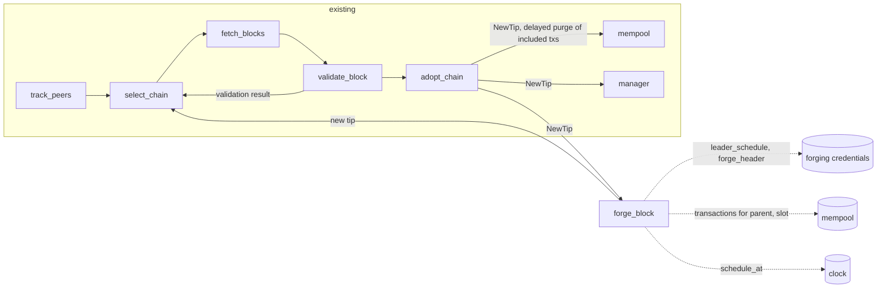

# Block Forging

Currently, Amaru follows the chain but does not extend it. This document describes how a stake pool running Amaru would produce blocks in Ouroboros Praos. The goal is a valid block with limited wasted work. The Haskell node is our reference for what "valid" means, and this document links to the relevant code, but the shape of our implementation is our own.

Ouroboros Leios will introduce many changes for Amaru overall, but they are orthogonal to this document. For example, there will be mempool improvements, changes to the ledger, and new independent processes for votes, announcements, and handling of endorsement blocks (EBs). In theory, there will be no changes directly to the block forging architecture, though that may change as we learn more about Leios.

## Context

### Slot leadership is decided before the epoch starts

A pool leads a slot when its VRF output for that slot, hashed with the epoch nonce, falls below a threshold that depends only on its stake share and the active slot coefficient `f`. See the Praos paper ([eprint 2017/573](https://eprint.iacr.org/2017/573)) for the protocol, and [`checkLeaderValue`](https://github.com/IntersectMBO/cardano-ledger/blob/bc7df956110912d3b1e3501dbb66e466f7220398/libs/cardano-protocol/src/Cardano/Protocol/TPraos/BlockHeader.hs#L337-L371) for the check as implemented. The VRF input is `hash(slot ‖ epoch nonce)` ([`mkInputVRF`](https://github.com/IntersectMBO/cardano-ledger/blob/bc7df956110912d3b1e3501dbb66e466f7220398/libs/cardano-protocol/src/Cardano/Protocol/Praos/VRF.hs#L63-L78)).

Every input to that check is fixed before the epoch starts. The stake share comes from the snapshot taken two epochs earlier, which Amaru already exposes through `PoolSummaries`. The epoch nonce is fixed two days before the boundary (next section). So a pool could compute its whole leader schedule for an epoch in one pass. On mainnet that is 432,000 VRF evaluations.

The Haskell node does not do this. Its forging loop wakes on every slot and evaluates the VRF each time ([`forkBlockForging`](https://github.com/IntersectMBO/ouroboros-consensus/blob/0ce94ef215312633d44d049ea1a7e30eb4b3deb6/ouroboros-consensus-diffusion/src/ouroboros-consensus-diffusion/Ouroboros/Consensus/NodeKernel.hs#L549-L573), then [`checkIsLeader`](https://github.com/IntersectMBO/ouroboros-consensus/blob/0ce94ef215312633d44d049ea1a7e30eb4b3deb6/ouroboros-consensus-protocol/src/ouroboros-consensus-protocol/Ouroboros/Consensus/Protocol/Praos.hs#L408-L428)).

### The epoch nonce and the stability window

A header carries its VRF output, from which each node derives three nonces, **active**, **evolving** and **candidate**. Amaru does this in `evolve_nonce` and stores the result in the chain store keyed by header hash, as [`Nonces`](../crates/amaru-ouroboros-traits/src/praos/nonces.rs). The Haskell equivalents are the fields of [`PraosState`](https://github.com/IntersectMBO/ouroboros-consensus/blob/0ce94ef215312633d44d049ea1a7e30eb4b3deb6/ouroboros-consensus-protocol/src/ouroboros-consensus-protocol/Ouroboros/Consensus/Protocol/Praos.hs#L270-L290).

- The **active** nonce is the one this epoch's leader checks use.
- The **evolving** nonce is a running hash that every block folds its VRF output into.
- The **candidate** nonce is a copy of the evolving nonce that stops updating once a block's slot is within the randomness stabilisation window of the next epoch, `4k/f` slots.
  See the freeze in [`reupdateChainDepState`](https://github.com/IntersectMBO/ouroboros-consensus/blob/0ce94ef215312633d44d049ea1a7e30eb4b3deb6/ouroboros-consensus-protocol/src/ouroboros-consensus-protocol/Ouroboros/Consensus/Protocol/Praos.hs#L518-L521) and Amaru's [`randomness_stability_window`](../crates/amaru-ouroboros/src/praos/nonce.rs).

At the epoch boundary, the new active nonce is the hash of the frozen candidate and a header hash from the tail of the previous epoch ([Haskell](https://github.com/IntersectMBO/ouroboros-consensus/blob/0ce94ef215312633d44d049ea1a7e30eb4b3deb6/ouroboros-consensus-protocol/src/ouroboros-consensus-protocol/Ouroboros/Consensus/Protocol/Praos.hs#L442-L468), Amaru's `Nonces::next_active`). The freeze exists so that the last blocks of an epoch cannot grind the next nonce. For us it has a second use: from the first block adopted inside the window, the next epoch's nonce is known, and thus so is our schedule.

### Keys

There are four keys used in the forging process. The Haskell node reads them in [`readLeaderCredentials`](https://github.com/IntersectMBO/cardano-node/blob/a38eac60bceb1a64a4ffa29e2d49d802787ce171/cardano-node/src/Cardano/Node/Protocol/Shelley.hs#L161-L211) and bundles them as [`PraosCanBeLeader`](https://github.com/IntersectMBO/ouroboros-consensus/blob/0ce94ef215312633d44d049ea1a7e30eb4b3deb6/ouroboros-consensus-protocol/src/ouroboros-consensus-protocol/Ouroboros/Consensus/Protocol/Praos/Common.hs#L272-L297).

- The **cold key** is an Ed25519 key kept offline. Its hash is the pool id. It signs the pool registration certificate and the operational certificate. The running node only needs the associated public key.
- The **VRF key** lives on the block producer. It proves slot leadership. Cardano uses ECVRF-Ed25519-SHA512-Elligator2 from [draft-irtf-cfrg-vrf-03](https://datatracker.ietf.org/doc/html/draft-irtf-cfrg-vrf-03), bound in [`Cardano.Crypto.VRF.Praos`](https://github.com/IntersectMBO/cardano-base/blob/d92e2e3841eaad354c5e1ef77b458b347f471271/cardano-crypto-praos/src/Cardano/Crypto/VRF/Praos.hs#L524-L526). Amaru already has the verify side in `amaru-ouroboros/src/vrf`.
- The **KES key** (key evolving signature) lives on the block producer and signs headers. It is a forward-secure scheme (defined in [eprint 2001/034](https://eprint.iacr.org/2001/034)), instantiated as [`Sum6KES`](https://github.com/IntersectMBO/cardano-base/blob/d92e2e3841eaad354c5e1ef77b458b347f471271/cardano-crypto-class/src/Cardano/Crypto/KES/Sum.hs#L104) over Ed25519: 64 periods, each `slotsPerKESPeriod` long. Evolving the key to the next period erases the previous period's secret, so a stolen key cannot sign old slots. Only the verification side exists in Amaru today.
- The **operational certificate** binds a KES verification key to the pool. It carries the KES verification key, a counter, a start period, and a cold-key signature over those three fields ([`OCert`](https://github.com/IntersectMBO/cardano-ledger/blob/bc7df956110912d3b1e3501dbb66e466f7220398/libs/cardano-protocol/src/Cardano/Protocol/TPraos/OCert.hs#L84-L91)). Every header carries it.

  The [OCERT rule](https://github.com/IntersectMBO/ouroboros-consensus/blob/0ce94ef215312633d44d049ea1a7e30eb4b3deb6/ouroboros-consensus-protocol/src/ouroboros-consensus-protocol/Ouroboros/Consensus/Protocol/Praos.hs) checks four things:

  1. The cold-key signature must verify against the header's issuer key.
  2. The header's KES signature must verify under the hot key evolved by `current period - start period`.
  3. The current KES period must lie within the certificate's window: at or after the start period and before `start + maxKESEvolutions` (62 on mainnet, leaving a margin of two under the 64 periods of Sum6KES), so a certificate covers 62 consecutive periods.
  4. The counter must be equal to or one greater than the last counter seen for that pool on the current chain.

A pool can therefore forge only when its certificate covers the current KES period. The Haskell node checks this per slot in [`praosCheckCanForge`](https://github.com/IntersectMBO/ouroboros-consensus/blob/0ce94ef215312633d44d049ea1a7e30eb4b3deb6/ouroboros-consensus-protocol/src/ouroboros-consensus-protocol/Ouroboros/Consensus/Protocol/Praos.hs#L697-L716).

### How the Haskell node forges

For reference, the per-slot loop in [`forkBlockForging`](https://github.com/IntersectMBO/ouroboros-consensus/blob/0ce94ef215312633d44d049ea1a7e30eb4b3deb6/ouroboros-consensus-diffusion/src/ouroboros-consensus-diffusion/Ouroboros/Consensus/NodeKernel.hs#L573-L760) does the following at every slot:

1. Pick the parent: the tip, or the tip's parent if the tip already sits in this slot (for example because the node has already received and validated another pool's block for the same slot).
2. Tick the protocol state to the slot and evolve the KES key if the period changed.
3. Run the leader check, then the "can forge" check.
4. Take the longest prefix of the mempool that fits the block ([`getSnapshotFor`](https://github.com/IntersectMBO/ouroboros-consensus/blob/0ce94ef215312633d44d049ea1a7e30eb4b3deb6/ouroboros-consensus/src/ouroboros-consensus/Ouroboros/Consensus/Mempool/API.hs#L184-L200), [`snapshotTake`](https://github.com/IntersectMBO/ouroboros-consensus/blob/0ce94ef215312633d44d049ea1a7e30eb4b3deb6/ouroboros-consensus/src/ouroboros-consensus/Ouroboros/Consensus/Mempool/API.hs#L432-L440)). The mempool keeps its transactions validated against the tip, so the body is not validated again here.
5. Build and sign the header ([`forgeShelleyBlock`](https://github.com/IntersectMBO/ouroboros-consensus/blob/0ce94ef215312633d44d049ea1a7e30eb4b3deb6/ouroboros-consensus-cardano/src/shelley/Ouroboros/Consensus/Shelley/Ledger/Forge.hs#L42-L100)).
6. Hand the block to the chain database and wait for it to be adopted or rejected.

Steps 2, 3 and 5 are callbacks in the [`BlockForging`](https://github.com/IntersectMBO/ouroboros-consensus/blob/0ce94ef215312633d44d049ea1a7e30eb4b3deb6/ouroboros-consensus/src/ouroboros-consensus/Ouroboros/Consensus/Block/Forging.hs#L82-L156) record, not in the loop.

### Amaru today

Consensus is a graph of pure stages ([EDR 011](./011-deterministic-simulation-testing.md)). Headers arrive in `track_peers`, `select_chain` ranks tips, `fetch_blocks` downloads bodies, `validate_block` asks the ledger to apply them, and `adopt_chain` updates the best chain and tells the mempool and the network manager about the new tip. Every effect with the outside world, including the ledger, the stores and the clock, goes through a resource so the graph can run under simulation. Nothing in the graph produces a block.

## Decision

We add one stage, `forge_block`, wired into the graph only when forging credentials are configured. It receives the adopted tip from `adopt_chain`, like the mempool does, and it sends exactly one message: a new tip to `select_chain`. When a led slot fires it forges and stores the block and its header, then sends that `NewTip`. From there our block is treated like any block a peer sent us.

Note the graph below only contains the stages that are relevant to block forging.

### Once per epoch

The candidate nonce freezes at slot `NextEpoch - 4k/f`. On the first `NewTip` whose header is inside that window (Amaru: `randomness_stability_window` returns `is_within_stability_window == false`), the stage:

1. Computes the next epoch's nonce with `Nonces::next_active` from the tip's stored nonces (candidate plus previous-epoch tail hash). Before the freeze this candidate can still change, so it is not used until the window has opened.
2. Asks the credentials resource for the slots we lead in that epoch, given the nonce and our stake share from `PoolSummaries`. This is detached (`Effects::detach`): 432,000 VRF evaluations on mainnet must not occupy the stage. The result comes back as a message. The TUI can show this schedule immediately as tentative.
3. From the returned slots, keeps those still in the future and arms **only the next** `DueLead(slot)` with `Effects::schedule_at`. Pure-stage wants a single outstanding self-schedule, not one timer per led slot. After that slot is handled (or cancelled), the stage arms the following one.

Each `DueLead` is scheduled 50 ms before slot onset, and forging starts then, so the block can diffuse as the slot begins. The handler reads the clock when the timer arrives, because wake-up can be earlier or later than that schedule. An earlier wake waits until 50 ms before onset. A wake in the last 50 ms of the slot, or after the slot, is a missed slot (`woke_late`) and is not forged. A wake that is merely later than the timer, but still before that deadline, forges immediately. The block is not sent to `select_chain` until slot onset, so we do not publish a future header. If forging overruns onset, the tip is sent immediately.

The last block that contributed to the candidate is not yet `k` deep when the window opens, so the schedule is not settled until `k` blocks have been adopted past the freeze. The stage reports how many of those `k` blocks have been adopted (a confidence / chain-depth mark) with the schedule. Until then a rollback that reaches back before the window can change the candidate, and if one does, the stage cancels the outstanding `DueLead` with `Effects::cancel_schedule` and repeats the steps above from the new tip. A rollback that stays inside the window does not touch the candidate and needs no action. Once `k` blocks have passed, the schedule can no longer change.

If the epoch boundary arrives before `k` blocks have been adopted, nothing changes. We keep using the schedule we have. The remaining risk is a rollback into the previous epoch that reaches past the window, and in a healthy network that does not happen.

On startup the stage is preloaded with the current adopted tip and the same steps run for the remaining slots of the **current** epoch from the tip's **active** nonce. If the tip is already inside the freeze window, the **next** epoch's nonce is `Nonces::next_active` and that epoch is scheduled immediately as well; a later `NewTip` is not required for it.

### Once per led slot

When `DueLead(slot)` fires:

1. Check that the operational certificate covers the slot's KES period. If not, log a warning and stop.
2. Pick the parent from the adopted tip:
   - If `tip.slot < slot`, the parent is the tip.
   - If `tip.slot == slot`, the parent is `tip.parent`. This is the case when the node has already received and validated another pool's block for this slot.
   - If `tip.slot > slot`, log a missed slot and stop. Headers are only validated after their slot time has started, so this path is not reachable when the rest of Amaru works as designed; the check is defensive so we never forge a block whose parent is later than its own slot.
3. Ask the mempool for a sequence of transactions that is valid on the parent's state as of our slot and fits in a block. That sequence is the block body as-is; the stage does not validate it and does not consult the ledger. If the mempool is empty — including when a same-slot competitor already consumed the interesting transactions — still forge. An empty block collects fees and keeps the chain moving; skipping the slot would give that up.
4. Ask the credentials resource to forge the header: VRF proof for the slot, block body hash, KES signature for the period. KES evolution to `slot_to_kes_period(slot) - operational_cert_kes_period` happens inside that signing procedure. Praos does not require persisting the evolved key.
5. Run the header through the same `validate_header` every peer header passes. In theory we only need the `evolve_nonces` effect; the full `validate_header` function costs us almost nothing.
6. Store the header and the block, send the new tip to `select_chain`, then arm the next remaining `DueLead` if any.

Parent selection happens at the start of this handler. The rest of the work is one message transition: if `adopt_chain` sends a `NewTip` while we are forging, that message waits in the mailbox until we finish. We do not abort, restart, or change parent mid-forge.

`select_chain` ranks the tip. If another same-slot block has already been processed there, ranking decides; we do not unstore a block we have already written. `fetch_blocks` sees the body is already stored. `validate_block` asks the ledger to roll forward, applying our block exactly as it would a peer's. This is the first and only time the ledger sees the body. `adopt_chain` then tells the mempool, the manager and `forge_block` about the new tip, and the manager serves the block to peers.

### Rules

- **Secrets never enter stage state.** Stage state is serialised into the trace buffer on every message. The VRF and KES keys live in a resource and answer two effects, `leader_schedule` and `forge_header`. The stage keeps only public facts: the led slots, the certificate's start period and evolution limit.
- **Compute the schedule once per epoch.** Every input to the leader check is fixed once the candidate freezes, so the stage computes the schedule when the window opens and recomputes only if a rollback reaches past the window. There is no per-slot VRF loop. Only the next `DueLead` is armed at a time.
- **Do not abort an in-flight forge.** Parent selection is the first step of `DueLead`. A `NewTip` that arrives while that handler runs waits in the mailbox; the forged block keeps the parent it already picked.
- **Enter the pipeline at `select_chain`, not `adopt_chain`.** `adopt_chain` assumes the ledger has applied the block and that `validate_block` and `select_chain` have moved their tip. Skipping them leaves `validate_block` believing the old tip is current, so the next upstream sibling of our block would be applied as an extension and fail. Entering at `select_chain` keeps every stage's bookkeeping right. Our block is validated once, on that path, like any other.
- **The ledger plays no part in forging.** The mempool hands us a body that is valid on the parent, and the stage builds a header over it. The ledger first sees the block when `validate_block` applies it.
- **Everything is simulatable.** Time comes from `schedule_at`, keys from a resource, the mempool from a resource. Leader-schedule computation is detached so the stage can still handle `NewTip` and `DueLead` while VRFs run. A pure-stage test can drive an epoch boundary and a led slot with a mocked credentials resource and assert the resulting state.
- **The header identifies Amaru as the forger.** The header's protocol version carries a major and a minor. The Haskell node's `chainChecks` rejects a header only when the major exceeds the ledger's current version, and it fills the minor from node configuration, zero on mainnet. Amaru's `validate_header` does not read the field. We set the minor to a 64-bit value that names Amaru and the git commit it was built from, so anyone reading the chain can tell which node produced a block and which build. The exact encoding is decided when it is implemented.

## Consequences

### Mempool

Forging needs one thing from the mempool: given a parent and a slot, a sequence of transactions that is valid in that order on the parent's state as of that slot and fits within the block limits (max body size, max execution units). The stage treats the result as a well-formed body. How the mempool produces it, including how it reaches the parent's state when the parent is the tip's parent, is its own concern and is not decided here. Today's `Mempool::take` does not offer this.

Taking transactions for a block does not remove them from the mempool. Our block may lose to a competing one, and dropping its transactions at forge time would lose them for good. Instead the mempool should purge a transaction only once a block containing it has been adopted, triggered by the `NewTip` messages it already receives from `adopt_chain`.

### Operations

Forging depends on the wall clock, so the NTP requirement from [EDR 014](./014-time-in-amaru.md) becomes a hard requirement for pools. Operators are expected to configure NTP correctly. As a later addition, not part of this decision, the node may periodically check the local clock against a reference and emit a `WARN` when it drifts, with an option to disable the check. Operators must also rotate the KES key and certificate before the 62-period limit, as with the Haskell node. A missed slot is logged with the reason: certificate not yet valid, expired, or the adopted tip's slot is already past ours.

### TUI

The terminal UI from [EDR 030](./030-embedded-terminal-observability-ui.md) can give an operator a view of forging. For example: the led slots still ahead in this epoch and the next, the time to the next one, how many of the `k` blocks since the freeze have been adopted (whether the schedule is settled), the KES period in use and how many remain on the certificate, and the outcome of each led slot, whether the block was adopted, lost to a competitor, or missed and why. Highlighting mempool transactions that involve the pool address is useful and can come later.

Key management belongs in both the CLI and the TUI: load, inspect, and rotate the operational certificate and KES key without restarting the node.

The TUI is a consumer of telemetry, so forging status comes from traces the `forge_block` stage emits and from nothing else. None of it is required for block production. A pool with the TUI disabled forges exactly the same blocks.

## Discussion points

- **KES key source.** The Haskell node can read the key from a file or talk to a KES agent that holds it in locked memory. We need to decide on our source.
- **Schedule while syncing.** During catch-up, `NewTip` crosses many historical windows. The stage should only build a schedule when the slots it would produce are in the future.
