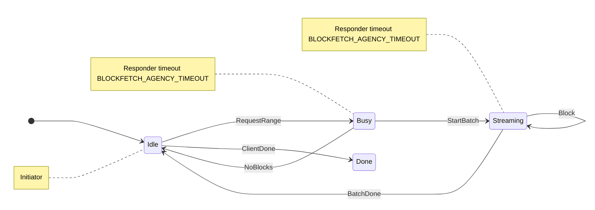

# Checking typestate mini-protocol handlers against the network spec

Does not supersede [EDR-021](./021-switching-to-own-mini-protocols.md).

## Motivation

[EDR-021](./021-switching-to-own-mini-protocols.md) promised that each mini-protocol’s network behaviour could be checked against the [Ouroboros network spec](../agent-inputs/network-spec.pdf) by looking at the handler’s state machine, not only by running simulations. That used to mean `ProtoSpec` walking a `ProtocolState` object.

Typestate remainders (sequences of effects along the transition from one state to the next) replace that object. They are richer than the spec diagram: they also mention mux demand (`WantNext`), injected `Pull`, agency timers, and node-local traffic (collector, store, `Fetch` / `Close`). Named typestate constructors need not match spec states — BlockFetch’s responder handles Busy and Streaming as a sequence from `Idle`. So the remainder is not 1:1 with Table 3.7 of the network spec, for example.

We still want a test, on ordinary Rust values, that the *wire conversation* implied by those typestate remainders is exactly the spec machine. The Rust type system already enforces local linear use of a remainder; it does not compare that remainder to the PDF.

## Decision

A protocol’s spec is a mermaid-like state diagram in code. BlockFetch lives in [`crates/amaru-protocols/src/blockfetch/spec.rs`](../crates/amaru-protocols/src/blockfetch/spec.rs):

```text
[*] --> Idle
Idle --> Busy: RequestRange
Idle --> Done: ClientDone
Busy --> Idle: NoBlocks
Busy --> Streaming: StartBatch
Streaming --> Streaming: Block
Streaming --> Idle: BatchDone
note left of Idle: Initiator
note left of Busy: Responder timeout BLOCKFETCH_AGENCY_TIMEOUT
note left of Streaming: Responder timeout BLOCKFETCH_AGENCY_TIMEOUT
```



That is the network-spec picture: states, messages, *who is allowed to speak* (agency), and how long the silent party may wait. The identifiers are the real types (`Idle`, `RequestRange`), so go-to-definition works. Building the spec also checks that every `Message` variant is either an edge or listed `unused […]` (needed later for Handshake).

A handler is a typestate remainder graph (`Proto::type_graph()`). To compare it to the spec we *project*: drop mux plumbing, timers, and local roles, and keep only sends and receives on the peer channel. A remainder sequence such as `StartBatch; Block*; BatchDone` becomes a path of labeled edges. Vertices need not keep spec names; only the message types and who speaks matter.

The projected graph is a communicating finite-state machine (CFSM): two parties, FIFO-ish messages, *exactly one side has the floor* in each state (no mixed “I might send or receive”). That is the network spec’s §3.2 model, and it is the binary case of session types. Honda–Vasconcelos–Kubo is the usual syntax (`!` send, `?` receive, choice, loop). We do not type-check the handler in that syntax; we build the machine in tests and compare.

Comparison is *structural*. Walk both machines from the start, matching edge labels and agency. Names are diagnostic only (e.g. `Idle` in error dumps). Initiator and responder must be *duals*: one’s send is the other’s receive; who-has-the-floor is a property of the *state*, not swapped. After `ClientDone` the spec is `Done`. Restarting a new session (which is automatic for responders) is handler code (`state = initial_state()`), not a cycle in the diagram.

We require an *exact* match of labels, not “the handler may receive extra kinds.” In session-type theory, Gay–Hole *subtyping* treats a participant that still accepts more incoming messages as a subtype of a pickier one (it is a more liberal receiver). The network spec does the opposite: an unexpected message *aborts* the bearer. Extra receive arms would swallow a peer bug. Extra send arms would be our bug. So projection must not leave leftover wire labels.

Pipelining (CIP-0164) is *N* lock-step instances plus occupancy. The check is performed on one instance, multiplexing is layered on top in an almost transparent fashion. Mux `WantNext` / `Pull` well-formedness is an extra test in `amaru-protocols` (`check_want_next`); it is not part of the session library, because the mux does not live in `amaru-pure-stage`.

A protocol’s conformance test is then: build the mermaid spec, project both handlers, refine the spec, check duality, plus `check_want_next`. See `protocol_conformance` in `spec.rs`.

### What this does not prove

Typestate already forbids skipping remainder effects. `convert_input` still aborts unexpected mail at runtime; mux overflow is unchanged. The test does not prove local decisions (`StartBatch` vs `NoBlocks`), store I/O, timeout *durations* (only that a timer is armed), pipelining cursors, or that `Done` is followed by `initial_state()`.

## Consequences

- Each typestate protocol gets a `spec.rs` that is the network diagram, readable by humans (to cross-check with the PDF) and by `cargo test`.
- `ProtoSpec` / `miniprotocol()` stay for unmigrated protocols until those handlers are rewritten.
- Ambiguous remainders (two wire actions in parallel, mixed send/receive in one state, a `Repeat` of several different wire messages) fail the test — the typestate API currently is more expressive than the session types can handle.
- Session theory stays in `amaru-pure-stage::session`. Mux-specific `WantNext` stays in `amaru-protocols`.

## Discussion points

./.

## References

### Amaru

- [EDR-021](./021-switching-to-own-mini-protocols.md) — own mini-protocols; static analysis of the network machine
- [EDR-011](./011-deterministic-simulation-testing.md) — simulation (unchanged)
- [EDR-024](./024-peer-handling-infrastructure.md) — reset after `StDone`
- [`blockfetch/spec.rs`](../crates/amaru-protocols/src/blockfetch/spec.rs) — worked example
- [`amaru-pure-stage::session`](../crates/amaru-pure-stage/src/session.rs) — spec, projection, structural compare

### Ouroboros / Cardano

- [Network spec](../agent-inputs/network-spec.pdf) §3.2 (agency CFSMs), §3.8 BlockFetch
- [CIP-0164](https://cips.cardano.org/cip/CIP-0164) — pipelining as *N* lock-step copies; not in this projection
- `typed-protocols` (Haskell) — GADT encoding of the same exclusive-agency machines

### Session types and CFSMs

- Honda, Vasconcelos, Kubo, *Language primitives and type discipline for structured communication-based programming*, ESOP 1998 — binary session types (`!` / `?` / choice / recursion)
- Honda, Yoshida, Carbone, *Multiparty asynchronous session types*, POPL 2008 — projection from a global type onto one role (we project a *handler* onto the mux, which is a different hiding step)
- Brand, Zafiropulo, *On communicating finite-state machines*, JACM 1983 — CFSMs
- Deniélou, Yoshida, *Multiparty session types meet communicating automata*, ESOP 2012 — binary session types ≈ deterministic two-machine CFSMs without mixed states (the network spec)
- Gouda, Manning, Yu, *On progress for two communicating finite state machines*, 1984 — half-duplex two-machine progress
- Gay, Hole, *Subtyping for session types in the pi calculus*, Acta Informatica 2005 — extra inputs as a subtype; we reject that under abort-on-unexpected
- Kozen, *A completeness theorem for Kleene algebras*, 1994 — `Repeat` as star; we only expand a single remaining wire effect
- Burlò, Francalanza, Scalas, *On the monitorability of session types*, 2021 — runtime monitors; our test is of the *declared* machine, not a wire sniffer
