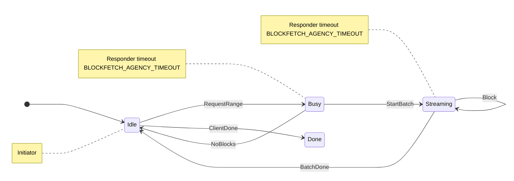

# Checking typestate mini-protocol handlers against the network spec

Does not supersede [EDR-021](./021-switching-to-own-mini-protocols.md).

## Motivation

[EDR-021](./021-switching-to-own-mini-protocols.md) promised that each mini-protocol’s network behaviour could be checked against the [Ouroboros network spec](../agent-inputs/network-spec.pdf) by looking at the handler’s state machine, not only by running simulations.

### The previous check

That check was a `ProtoSpec` table walked by a `ProtocolState`. `ProtocolState::network` and `ProtocolState::local` were the wire transitions; a separate `StageState` made the node-local decisions and emitted an action for the protocol object to perform.
BlockFetch’s table, before the handler moved to typestate, was of this shape (cf. [`5d0a7980`](https://github.com/pragma-org/amaru/blob/5d0a7980dc02173640445e4226fae8448c560afa/crates/amaru-protocols/src/blockfetch/mod.rs#L30-L51)):

```rust
spec.init(Idle, client_done(), Done);
spec.init(Idle, request_range(), Busy);
spec.resp(Busy, no_blocks(), Idle);
spec.resp(Busy, start_batch(), Streaming);
spec.resp(Streaming, block(), Streaming);
spec.resp(Streaming, batch_done(), Idle);
```

Each arm was one wire message and a dummy payload, because the table stored values. The states were the names in the network-spec diagram.

### Typestate or how to encode linearity in Rust

State progression along the program source code has been expressed in Rust for a long time already: the builder pattern is made type-safe by requiring some steps to be taken in order to not forget anything (see for example [rustls::ConfigBuilder](https://docs.rs/rustls/latest/rustls/struct.ConfigBuilder.html)’s second type parameter).

The main ingredient for making this safe and effective is using Rust’s _affine types_, meaning that we can consume a value to make it unusable — this way, a function can consume a builder of a given type and return a new builder with a modified type.

The idea in this EDR is to apply this principle to the execution of effects in pure-stage, only there are whole lists of effects to be run, and those lists depend on which mini-protocol handler we are looking at. The main abstraction we use here is called a “typestate remainder”, which is a type-level object that we perform type-level computations one.

### Typestate remainders

When a typestate-enabled stage receives an input message, it will need to match this to the current protocol state in order to see which action is expected next.
The typestate definition therefore provides a permission to receive a certain message type in the given state, and when that reception occurs, the `State::receive` method returns a **remainder**.
This remainder is a type describing what effects the protocol handler still must perform before it can finish in the next state.

The shape of a remainder is constructed from two elements: `A, B` means that `B` happens after `A`, and `A | B` means that either `A` or `B` happens. These can in principle be mixed as desired (pending appropriate extension of pure-stage’s typestate API capabilities when doing ever more fancy things).
The atoms are all the effects that pure-stage can express, like `Send`, `Call`, `Wait`, `ScheduleAt` etc., or it can be `Repeat<...>` for zero or more occurrences of what is inside the type parameter.

The remainder is carried as a type parameter on the `Session`, which is essentially a wrapper around `amaru_pure_stage::Effects`.
When the remainder has been exhausted, the `Session::finish()` method becomes available that produces the next named protocol state, which can then either be stored in the stage state or used directly for the next transition.

Here is an example of the typestate definition for the blockfetch responder:

```rust
on_receive!(Idle as ServerIdleIn {
    Pull => { Send<ToMux, WantNext> => Idle }
    RequestRange => {
        Call<ToInitiator, StartBatch>, Repeat<Call<ToInitiator, Block>>, Call<ToInitiator, BatchDone>, Send<ToMux, WantNext> => Idle
        | Call<ToInitiator, NoBlocks>, Send<ToMux, WantNext> => Idle
    }
    ClientDone => { Send<ToMux, WantNext> => Done }
});
on_receive!(Done as DoneIn {});
```

All messages that can be received in state `Idle` are bundled in an `enum ServerIdleIn` for convenient handling in the stage logic.
Reception of `RequestRange` triggers the two cases of either a `StartBatch` message followed by `Block` messages and finally a `BatchDone` message, or the `NoBlocks` case.
Note how the `WantNext` sent to the mux is also encoded so it cannot be forgotten in the stage logic.

## Decision

Protocol handlers are specified using typestate. A mini-protocol is then checked against the network spec in three steps:

1. Write the network-spec diagram as a mermaid-like table in the code (`session_spec!`).
2. Read the state machine implied by the remainders (`Proto::type_graph`, then `project`).
3. Compare those machines structurally. Wire labels, direction, and agency must match. State names are diagnostic only (`Idle` in a dump, not part of the equality).

BlockFetch’s table is [`blockfetch/spec.rs`](../crates/amaru-protocols/src/blockfetch/spec.rs):

```text
[*] --> Idle
Idle --> Busy: RequestRange
Idle --> Done: ClientDone
Busy --> Idle: NoBlocks
Busy --> Streaming: StartBatch
Streaming --> Streaming: Block
Streaming --> Idle: BatchDone
note left of Idle: Initiator
note left of Busy: Responder timeout BLOCKFETCH_AGENCY_TIMEOUT
note left of Streaming: Responder timeout BLOCKFETCH_AGENCY_TIMEOUT
```



The identifiers are the real types (`Idle`, `RequestRange`), so go-to-definition works. The first token, `Message`, is the protocol’s wire enum: every edge label must implement `Into<Message>`, and every `Message` variant must be an edge or listed in `unused […]` (Handshake needs the unused list). The `note` lines record who may send in that state, and the optional `timeout` constant is stored on the spec as a `Duration`.

`project` drops mux plumbing, timers, and local roles, and keeps sends and receives on the peer channel. `StartBatch`, then `Block*`, then `BatchDone` becomes three labeled edges. The vertex names are informative only, the typestate declaration may choose to not name all vertices explicitly (as is shown in the example of the blockfetch responder in the motivation section).

The projected graph is a communicating finite-state machine for one protocol instance: two parties, a FIFO of messages between them, and exactly one side allowed to speak in each state. That is the same model as in §3.2 of the Ouroboros network spec. A state that could both send or receive is rejected (`MixedAgency`). Failure dumps print a send as `!RequestRange` and a receive as `?Block`, as is customary in binary session types (which is the underlying theory). There is currently no need to parse this session type syntax, though.

Initiator and responder are the two orientations of one diagram. `dual` swaps send and receive and copies agency, because who holds the floor is a property of the state. After `ClientDone` the diagram is in `Done` and has no edge back, which means this is a terminal state. The BlockFetch responder still needs to return to the initial state as per the network spec, so that it can receive a new message once the other side starts using the bearer again, which it does by manually setting the state to `initial_state::<Idle>()` — mini-protocol lifecycle is not modelled using typestate.

The overall verification relation we want is refinement: the handler’s behaviour should be acceptable to the spec. The decision is to avoid implementing a subtyping (i.e. refinement) logic and instead specify which details to remove from the typestate declaration before comparing the captured wire behaviour to the specification. This way, that last step is simply structural equality of the state diagrams, which can easily be implemented in an efficient manner. Note how this matches the network spec in that any unexpected (i.e. additional) behaviour shall terminate the bearer — there is no meaningful degree of freedom for refinement apart from the duration of the timeouts.

### Pipelining and `WantNext`

`WantNext` is how the handler gives the mux permission to deliver one inbound message. On a single instance the placement is fixed by the diagram: before a state receives, the remainder sends `WantNext`. `check_want_next` checks that placement. It lives in `amaru-protocols` because the mux does not live in `amaru-pure-stage`. Projection treats `WantNext` and `Pull` as plumbing and drops them, so the session check never sees them (as described above).

[CIP-0164](https://cips.cardano.org/cip/CIP-0164) runs *N* lock-step copies of a mini-protocol initiator instance. If every copy sent `WantNext` up front, the mux would hand out *N* messages and the back-pressure would be gone. Only the copy whose turn it is may send `WantNext`. When that copy has taken its message, the next copy is woken with `Pull`, and the `Pull` arm is what sends `WantNext`. The handler code is the same with and without pipelining. The part that is not the handler is the wrapper: at depth 1 it synthesizes `Pull` itself (`drive`); at depth *N* the pipeliner (`pipelined`) owns the cursor and delivers `Pull` to the instance that is now allowed to receive. `BLOCKFETCH_PIPELINE_N` is that depth for BlockFetch.

### Checks

[`protocol_conformance`](../crates/amaru-protocols/src/blockfetch/spec.rs) runs the rows for both roles. `h_r.dual()` (the dual of the responder logic) is then compared to the initiator projection, ensuring that this is indeed the same diagram read from the other side.

| Check | What it looks at | Why |
| --- | --- | --- |
| `session_spec!` | The diagram, `Into<Message>`, and the variant coverage (`edge` or `unused`) | The table stays the PDF, and the wire enum stays the table |
| `project` | Peer sends and receives; plumbing, timers, and local roles removed | The spec has no edges for those |
| `assert_structurally_eq` | Labels, direction, agency, terminals of the reachable machine. Names ignored. An extra edge, or a redundant state, fails | The wire conversation is Table 3.7 |
| `dual` | Send and receive swapped, agency copied | One diagram, two roles |
| `check_timeouts` | `SetTimeout` / `ClearTimeout` present or absent on the remainder, by the spec’s agency notes | A timed state must arm a timer. The `Duration` argument is not read |
| `check_want_next` | `WantNext` and `Pull` on the unprojected graph | Back-pressure, including the pipelined case |
| `assert_wire_inputs_cover_receives` | Every receive arm is plumbing, local, or wire, and every wire label occurs in the spec | A forgotten arm does not skip the comparison |

`SessionSpec::assert_refines` is a separate helper for two undirected tables. It is equality after a name map. It does not compare timeouts, and it is not the inclusion check the name suggests. `ProtoSpec::assert_refines` is the same idea on the old tables.

### Shapes the projection rejects

The typestate syntax can describe machines this CFSM cannot draw. The test fails instead of dropping the edge.

`Repeat` of two different wire messages (`star!(RequestRange, ClientDone)`) is the obvious case. A star in the projected machine is a self-loop of one label, left by a later different label (`Block*`, then `BatchDone`). A star of a sequence has no single label to loop on. Two wire stars with no wire message between them (`Repeat<A>, Repeat<B>`) are the same problem one step later: both loops would sit on one vertex, and `B` then `A` would be allowed. A trailing wire star whose next state is a different vertex (`Repeat<A> => Done`, or `Call<A>, Repeat<B> => Idle` once `A` has already moved the vertex) has no message to label the exit.

When a protocol actually needs one of those shapes, the projection has to grow an edge for it. Rewriting the handler so the star is one wire message with a visible exit is the path BlockFetch already uses. Encoding the same check in the type system, so that “it compiles” would be enough, was tried; Rust would not carry it. The test is that second checker.

### What this does not prove

The mux kills a protocol whose inbound buffer exceeds the `max_buffer` it was registered with (`protocols::mux::protocol::BUFFER_OVERFLOW`). Nothing here chooses or checks that limit.

`StartBatch` and `NoBlocks` are both legal wire arms. Which one runs depends on the store. The responder simulations `serve_range_sends_blocks_then_batch_done` and `missing_range_sends_no_blocks` are where that choice is tested.

`check_timeouts` checks that a timer effect is present. It does not check that the handler passes `BLOCKFETCH_AGENCY_TIMEOUT` rather than some other `Duration`.

The pipeliner’s cursor, the depth `BLOCKFETCH_PIPELINE_N`, and the order of two in-flight ranges are outside the one-instance machine. The initiator simulations (`two_ranges_pair_in_order` and its neighbours) cover the wrapper.

`Done` followed by `initial_state()` is the assignment in the responder’s `ClientDone` arm. The diagram ends at `Done`.

## Consequences

- Compiling the handler is not the whole check. `cargo test` runs the comparison above. A change to the network spec is a change to the `session_spec!` table in the repository. Nothing reads `network.pdf` at test time.
- The wire messages of a migrated handler are what the test can see. Node-local effects and the choice between two legal arms are tested by the handler’s simulations, as in the BlockFetch responder tests linked above.

The code is split the way the checks are split. Each migrated protocol gets a `spec.rs` next to its handlers. The session machine, projection, and structural comparison live in [`amaru-pure-stage::session`](../crates/amaru-pure-stage/src/session.rs). `WantNext` / `Pull` stay in [`amaru-protocols`](../crates/amaru-protocols/src/protocol/want_next.rs).

## Discussion points

./.

## References

### Amaru

- [EDR-021](./021-switching-to-own-mini-protocols.md) — own mini-protocols; static analysis of the network machine
- [EDR-011](./011-deterministic-simulation-testing.md) — simulation, which still covers the decisions this test does not see
- [EDR-024](./024-peer-handling-infrastructure.md) — reset after `StDone`
- [`blockfetch/spec.rs`](../crates/amaru-protocols/src/blockfetch/spec.rs) — the worked check
- [`amaru-pure-stage::session`](../crates/amaru-pure-stage/src/session.rs) — spec, projection, structural comparison

### Ouroboros / Cardano

- [Network spec](../agent-inputs/network-spec.pdf) §3.2 (agency CFSMs), §3.8 BlockFetch
- [CIP-0164](https://cips.cardano.org/cip/CIP-0164) — pipelining as *N* lock-step copies of one instance
- `typed-protocols` (Haskell) — GADT encoding of the same exclusive-agency machines

### Further reading

These are the papers behind the vocabulary. The implementation does not yet make use of advanced theorems; this might change if we later apply typestate within the consensus pipeline using multi-party session types.

- Honda, Vasconcelos, Kubo, *Language primitives and type discipline for structured communication-based programming*, ESOP 1998 — binary session types. The `!` / `?` marks in a failure dump are this syntax, used as display.
- Honda, Yoshida, Carbone, *Multiparty asynchronous session types*, POPL 2008 — projection of a multi-party global type onto one participant. We project a handler onto the peer channel, filtering out the interactions with other parts inside Amaru.
- Brand, Zafiropulo, *On communicating finite-state machines*, JACM 1983 — the two-party FIFO machines the network spec draws.
- Deniélou, Yoshida, *Multiparty session types meet communicating automata*, ESOP 2012 — deterministic two-machine CFSMs without mixed states are the binary session types. That is the network spec §3.2 restriction we enforce with `MixedAgency`.
- Gouda, Manning, Yu, *On progress for two communicating finite state machines*, 1984 — progress for half-duplex pairs. We stop at exclusive agency and do not check progress.
- Burlò, Francalanza, Scalas, *On the monitorability of session types*, 2021 — monitors that watch a running process. This test checks the machine the handler declared, not bytes on a connection. This line of research may later lead to proofs of deadlock-freedom for our consensus stagegraph.
