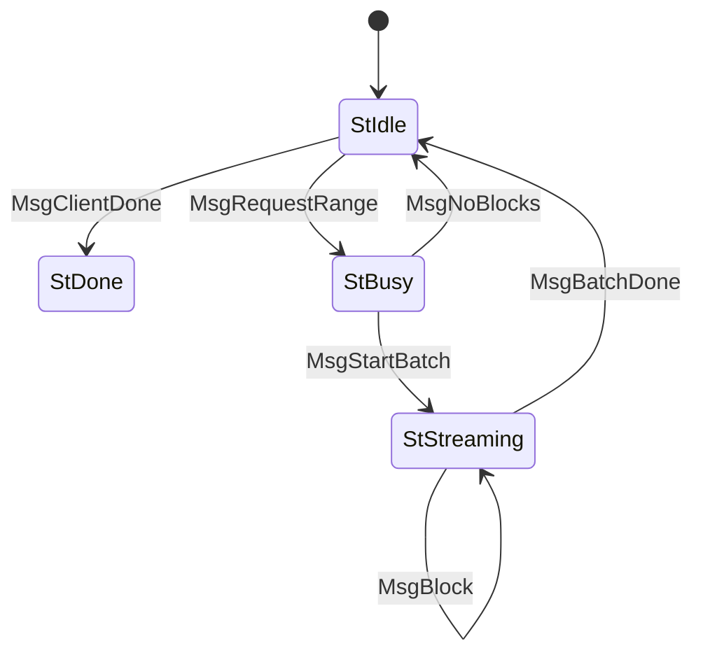
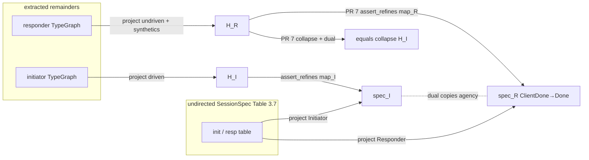

# Session-type projection of typestate remainders

- **Does not supersede:** [EDR-021](./021-switching-to-own-mini-protocols.md)

Algorithms, AST listings, and the BlockFetch walk live in the [Normative appendix](#normative-appendix-syntax-algorithms-blockfetch). That appendix is part of this record, not a scratch file.

## Overview

Typestate remainders describe each lock-step mini-protocol instance, but they are not the Ouroboros state machine: they also name mux plumbing (`WantNext`), injected `Pull`, agency timers, and node-local roles. Named constructors need not match spec states. Before rewriting every handler onto typestate we need a **value-level** check, run in `cargo test`, that a remainder graph *projects* onto the network spec.

The check is **not** a Rust type-level session-type encoding. Typestate already enforces local linear use of a remainder. This record specifies extraction, mux projection, comparison to an undirected spec table, and duality of the two roles. The session type for `ClientDone` is the spec (`StIdle --MsgClientDone--> StDone`); restart after `StDone` is handler code, not a remainder loop. Pipelining (CIP-0164) is out of the projection: the unit is one lock-step instance.

## Motivation

[EDR-021](./021-switching-to-own-mini-protocols.md) split each mini-protocol into a network state machine and local decision-making, and promised “static verification of conformance by analysing the state machine structure” plus a verified behavioural monitor. In the `ProtocolState` world those two promises are two objects:

- **Static analysis** is `ProtoSpec` in [`crates/amaru-protocols/src/protocol/check.rs`](../crates/amaru-protocols/src/protocol/check.rs): an undirected transition table with exclusive agency (`init` / `resp` / `sim_open`), `want_next` assertions inside `check()`, and `assert_refines` via a state surjection. `assert_refines` is **not called in-tree**; only `check()` is. The `ProtocolState` bound sits on the impl block; the table comparison itself does not call `network` / `local`.
- **Runtime monitor** is [`miniprotocol()`](../crates/amaru-protocols/src/protocol/miniprotocol.rs) wrapping a `ProtocolState`. Local code (`StageState`) never talks to the mux. It emits an `Action`; `ProtocolState::local` / `::network` accept or reject it; the driver is the only `WantNext` / `Send` citizen. A rejected step tears the bearer down. Handshake, KeepAlive, PeerSharing, TxSubmission2, and ChainSync still live there.

BlockFetch has already dropped `ProtocolState`. The monitor object is gone with it. What remains of EDR-021’s *intent* is the split (wire sequence vs local decisions) and the mux (ingress overflow). The *implementation* of the monitor is the typestate remainder plus `convert_input` (see [Successor of the EDR-021 monitor](#successor-of-the-edr-021-monitor)). BlockFetch currently only has string snapshots (`initiator_receive_allowances`, `responder_receive_allowances`) of `Session::describe()`.

Those strings are not a spec. They mention `WantNext`, `SetTimeout`, `ToCollector`, `Pull`, and they do not mention `StBusy` on the responder at all. The remainder algebra in [`crates/amaru-pure-stage/src/typestate.rs`](../crates/amaru-pure-stage/src/typestate.rs) is richer than `ProtocolState`:

1. Receiving the next mux frame requires `Send<ToMux, WantNext>`, which is Amaru plumbing and not a network-spec message.
2. Handlers track node-internal interactions in the same remainder (`Repeat<SendAny<ToCollector>>`, store I/O via `Session::external`, local `Fetch` / `Close`).
3. Agency timers (`SetTimeout` / `ClearTimeout`) and `Pull` (injected by `drive` / `pipelined` when occupancy becomes `Remote`) live in remainders too.
4. Named typestate constructors need not match spec states.

`FmtPar` / `Session::describe` walk the remainder at the type level and render a `String`. Tests cannot project a string onto Table 3.7 of the [network spec](../agent-inputs/network-spec.pdf) without duplicating the remainders. Extending `ProtoSpec::check` to “call `ProtocolState` methods” also fails: BlockFetch no longer has `ProtocolState`, and a remainder sequence is several spec transitions in one `OnReceive`.

Constraint: **projections and comparisons run in the Rust test suite, on ordinary values.** We do not encode the protocol conformance proof in the Rust type system.

## Decision

We adopt **binary session types as syntax** and **exclusive-agency CFSMs as the comparison representation**, both at the **Rust value level**.

1. A **session spec** is the network-spec state machine stored as an **undirected** table of the same shape as `ProtoSpec` — `(from, message, sender-role, to, sim_open?)` plus a timeout map — **without** the `ProtocolState` bound. `init` / `resp` / `sim_open` build it. `project(role)` orients labels as `Send` / `Recv`. The two spec projections are duals **by construction**: `Cfsm::dual` swaps only `Send`/`Recv` and **copies** agency (who-sends) and terminals. Timeouts stay on `SessionSpec`. Directions already encode “we send vs we receive”; who-sends is a global property of the state (Figure 3.6).
2. Each handler’s `on_receive!` remainders are *extracted* to a remainder AST, *projected* onto the mux participant (hide local roles, `WantNext`, timers, `Pull`), and `assert_refines` the spec projection for that role. Comparison is of **reachable** oriented tables after a **declared** state map. It does **not** compare timeouts.
3. Handler-to-handler duality is table equality of **collapsed** graphs after the declared `assert_refines` maps — no search, no magic `"StDone"` string. The spec dest of `ClientDone` is `StDone`. BlockFetch’s responder is **fixed in this stack** (PR 7) so that remainder and handler match; `SessionSpec::with_restart_on_done` is a library helper for later protocols, not how BlockFetch lands green.
4. Message identity is the protocol `Message` enum. `ProjectionConfig.wire_inputs` maps receive `InputName` → `Message`; `wire_payload` maps remainder payload last-segments → the **same dummy values** as `session_spec()`.
5. WantNext and timeouts each have a **driven / undriven** table. Driven timeouts follow `drive()`: `Fetch` must not `SetTimeout`; `Pull` must.

Gay–Hole session *subtyping* is **not** used: abort-on-unexpected-message makes extra receive labels a spec violation. CIP-0164 pipelining is not projected.

This EDR delivers the **checker** (PRs 1–6), the BlockFetch responder `ClientDone` **handler fix** (PR 7, as soon as the checker is applied to that remainder), and sharing the table with `ProtoSpec` (PR 8). Migrating other protocols onto typestate is follow-up work.

### What the check proves, and what it does not

| Layer | When | What it guarantees |
| :--- | :--- | :--- |
| Typestate `Select` / `CanFinish` | compile | The handler body cannot skip, reorder, or double-use a **declared** remainder effect. This is EDR-021’s `ProtocolState::local` check, moved to the type of the remainder. |
| `convert_input` `Err` → `terminate` | production / sim | An unexpected mailbox value (peer wire, or a local input the state does not admit) tears the handler down. This is EDR-021’s `ProtocolState::network` / illegal-`Action` abort, fused into the handler. |
| Mux ingress overflow | production / sim | Unchanged: `PerProto` still tears the bearer if the buffer exceeds `max_buffer`. Independent of typestate. |
| `SetTimeout` / `ClearTimeout` in the remainder | production / sim | Agency timers fire as `Internal::Timeout`. Presence is this EDR’s test; duration is a const test. |
| This EDR (test) | `cargo test` | The **declared** remainder graph, projected onto the mux, matches that role’s spec projection (`ClientDone → StDone`). Handler dual is collapse + `dual` with the declared maps. Successor of `ProtoSpec::check`. |

There is **no** leftover `ProtocolState` / `miniprotocol()` object after a handler migrates. The row that used to say “EDR-021 runtime monitor” is the three production rows above, not a separate stage.

### Successor of the EDR-021 monitor

EDR-021’s “verified behavioural monitor between local decision-making and the network stack” is `miniprotocol()`:

```text
  StageState  --Action-->  ProtocolState  --WantNext/Send-->  mux
       ^                         ^
  local decisions          only legal wire steps
                           (runtime reject → terminate)
```

`ProtoSpec::check` verifies `ProtocolState` in tests. `ProtocolState` is both the spec machine *and* the runtime gate.

Typestate collapses that gate into the handler. `ProtocolState` goes away on purpose:

```text
  handler body
    convert_input  --illegal-->  terminate          (peer / unexpected)
    receive + remainder
      Call/Send<ToPeer, _>      --only if remainder allows-->  mux
      Send<ToMux, WantNext>     --driven by occupancy / Pull-->
      SetTimeout / local roles
```

| EDR-021 piece | After typestate |
| :--- | :--- |
| `StageState` emits `Action`; `ProtocolState::local` may fail | Remainder type: `Idle.receive(Fetch)` only type-checks with `Call<ToResponder, RequestRange>`. Illegal *our* sends do not compile. |
| `ProtocolState::network` may fail | `convert_input` yields `Err`; handler calls `invalid` → `terminate` (see BlockFetch `initiator.rs` / `responder.rs`). Illegal *peer* messages still abort at runtime. |
| Driver issues `WantNext` from `Outcome.want_next` | Remainder contains `Send<ToMux, WantNext>`; `drive` / `pipelined` inject `Pull` when occupancy becomes `Remote`. |
| `ProtoSpec::check` on `ProtocolState` | This EDR’s projection of remainders. |
| Mux `max_buffer` overflow | Unchanged. Not part of `ProtocolState`. |

Unmigrated protocols keep `miniprotocol()` until they move. This EDR does **not** keep a second `ProtocolState` beside typestate “so the monitor still exists.” The monitor *is* the remainder plus `convert_input`. What this EDR does not replace is EDR-011 simulation, the mux, or EDR-021’s architectural split (one muxer per connection; initiator and responder as separate handlers).

The test does **not** prove:

- That the handler body performs the remainder in the order a human reader expects — typestate already does that locally.
- That local decisions are correct (`StartBatch` vs `NoBlocks` from the store; how many `Block`s). Exclusive choice only says both alternatives are legal.
- That `Session::external` / `clock` happen — they are deliberately **not** remainder effects.
- That `SetTimeout` is armed with the spec **duration**. Presence/absence is checked here; `BLOCKFETCH_AGENCY_TIMEOUT == 60s` is a separate const test.
- That Busy/Streaming **local** inputs buffered outside `on_receive!` (`pending_close` / `pending_fetch`) are the only extra admits. Those arms do **not** emit wire messages from Busy/Streaming; they later `receive(Close|Fetch)` on Idle, whose remainders extraction already sees. `pending_fetch` also runs `Pull` inline so `drive` will not double-inject.
- CIP-0164 cursor motion, admission, or “at most one outstanding `WantNext`” across *N* instances.
- Payload well-formedness, or per-state **size** limits (ingress buffer is registration-time).
- That the handler **resets** its live token to `initial_state()` after `StDone`. That is ordinary code outside the remainder graph. PR 7’s unit/simulation tests cover it; mux projection does not. The mux `Register` is unchanged.

Incompleteness is a **rejection criterion**: if projection is ambiguous, the test panics with both graphs.

### Formalism

Network spec §3.2: exactly one side has agency; an unexpected message aborts; initiator and responder are duals; termination is a shared `StDone`. That is Brand–Zafiropulo CFSMs restricted to **deterministic two-machine systems without mixed states** — the binary case of Deniélou–Yoshida (ESOP 2012). Honda–Vasconcelos–Kubo is the *syntax* we use for talking about `!` / `?` / choice / recursion. Gouda–Manning–Yu is a **progress theorem** for half-duplex two-machine communication, not a syntax equivalent of Honda 1998.

A BlockFetch global type matching Table 3.7, as **illustration only** (no π-calculus parser):

```text
G  = μX.  Idle ⊕ { RequestRange: Busy, ClientDone: end }
Busy       = & { NoBlocks: X, StartBatch: Streaming }
Streaming  = & { Block: Streaming, BatchDone: X }
```

The implementable object is the Table 3.7 undirected table (appendix). Role projection of that table (orient `Send`/`Recv` from who has agency) **is** Honda–Yoshida–Carbone projection in the binary case.

**Handler remainders are not `G`.** They are a local type with extra participants. Extraction + hiding is **hiding and unfolding**, not HYC endpoint projection. There are no merge/projectability side-conditions to look up.

**Comparison.** After hiding, mixed states, and nondeterminism have been rejected, deterministic machines have trace equivalence = bisimulation. Isomorphism holds only for the **reachable minimised** graph. We compare **reachable** fragments (`assert_refines` after dropping unreachable synthetics; named states with no incoming edge, e.g. unused responder `Done`, are not required to appear in the image). We do **not** use trace inclusion or Gay–Hole subtyping.

**`Repeat` is Kleene star** (Kozen). We expand a star of a **single remaining wire effect** to a CFSM self-loop plus the continuation (zero iterations). We do not decide KA equalities. v1 does not implement `Repeat` of *k > 1* remaining wire effects.

**Runtime monitors** (Burlò–Francalanza–Scalas) sit in a different layer: EDR-021 already monitors the wire. This EDR monitors the *declared machine* in tests.

### Duality and restart after `StDone`

The **session type** for `ClientDone` is Table 3.7: `StIdle --MsgClientDone--> StDone`. Formal projection does **not** model restart as a return to `Idle`. The session type does not loop.

Reset after `StDone` is **handler code** outside the remainder graph: replace the live token with `initial_state()` (and issue `WantNext` if the new Idle has remote agency and is not already armed). That is a `state` update of the same stage. It is **not** a mux `Register`. `Register` binds protocol id → handler mailbox for the life of the connection; `FromNetwork` keeps arriving at the same `StageRef`. Covered by **audit and unit/simulation tests**, not by mux projection. [EDR-024](./024-peer-handling-infrastructure.md) requires this reset (“after a peer transitioned a mini-protocol into `StDone`, that mini-protocol must be reset to its initial state”); it does not put a cycle in the protocol remainder.

Two layers, one typed pipeline (appendix K):

1. **By construction, on the spec.** One undirected `SessionSpec` with `ClientDone → Done`. `dual(project(Initiator))` equals `project(Responder)` (swap `Send`/`Recv` only; **copy** agency). On Table 3.7, `Idle` stays `Role::Initiator` on both projections.
2. **By check, on the handlers.** Each projected handler `assert_refines` **its** unannotated spec projection. Handler duality is then:

   ```text
   collapse(H_R, map_R).dual().assert_bisimilar(&collapse(H_I, map_I))
   ```

   `map_I` / `map_R` are the same declared surjections as `assert_refines`. `equals` is reachable-table equality. No search.

Today’s responder remainder is `ClientDone => WantNext => Idle`. That does **not** refine Table 3.7. **PR 7** (immediately after the responder checker in PR 6) changes the remainder to `Send<ToMux, WantNext> => Done` and, after `finish()`, sets `state = initial_state()`. `WantNext` stays hidable plumbing so the projected dest is spec `Done`; the live token is `Idle` again before the stage returns, so the next `RequestRange` is accepted on the same mux registration. Simulation (`close_idle_resets`) still observes `Idle` after the invocation.

`SessionSpec::with_restart_on_done` remains in the library for later protocols whose remainders still loop (KeepAlive / PeerSharing / TxSubmission2). BlockFetch tests after PR 7 **must not** use it. When some other protocol does, the panic prefix / test name must contain `with_restart_on_done`. `ProjectionConfig` does not carry it.

### Driven WantNext and timeouts (summary)

`drive` injects `Internal::Pull` on Switch→Remote ([`pipeline.rs`](../crates/amaru-protocols/src/protocol/pipeline.rs) 126–127). The remainder that *begins waiting* is `Pull`, not `Fetch`.

| Driven remainder | Occupancy | WantNext | SetTimeout | ClearTimeout |
| :--- | :--- | :--- | :--- | :--- |
| `Fetch` (local send) | Switch→Remote | **forbidden** | **forbidden** | — |
| `Pull` | stay Remote | **required** | **required** if spec timeout on that Remote state | — |
| wire recv, stay Remote (`StartBatch`, `Block`) | stay Remote | **required** | **required** if spec timeout | — |
| wire recv, enter Switch (`NoBlocks`, `BatchDone`) | Remote→Switch | **forbidden** | **forbidden** | **required** if leaving a timed state |
| `Close` | Switch→Terminal | **forbidden** | **forbidden** | — |

Undriven (BlockFetch responder: no `switch`, no `drive`, `Registered` → `Pull`): WantNext on the initial Pull arm and on every remainder that returns to a waiting state. SetTimeout only if we wait in a spec-timed state **and** we do not hold local agency along the remainder (responder Idle has no spec timeout; Busy/Streaming are sends — no `SetTimeout` on today’s responder, correctly).

Duration is **not** in the AST. `assert_refines` does not compare timeout maps.

### Scope

This record’s delivery is the checker, BlockFetch lock-step conformance, and the responder `ClientDone` handler fix as soon as that check exists. When a later protocol moves to typestate it gains `session_spec()` and drops string snapshots — that is not this EDR’s PR list. Handshake stays on `ProtoSpec` until someone encodes it; if they do, the table must include `QueryReply` and `sim_open`, not only §3.6.2.

## Consequences

Positive:

- BlockFetch has a machine-checked lock-step spec, not a string snapshot of `type_name`.
- Initiator/responder drift (`ClientDone → Idle` vs spec `StDone`) is a failing test until PR 7; PR 7 makes the remainder match Table 3.7.
- Synthetic states let responders keep compact remainders without lying about Busy/Streaming.
- `SessionSpec` is `ProtoSpec`’s table without `ProtocolState`, so PR 8 is a bound-stripping refactor rather than a second encoding.

Negative / cost:

- PR 7 is production handler code, not test-only. Wire should stay “`WantNext`, then a new session is legal”; the live token is `Done` then `initial_state()` inside one invocation. If that is observationally identical, `Skip-Changelog`; otherwise an operator entry.
- `with_restart_on_done` can rot on **other** protocols if they migrate without a similar handler fix. It is a named library helper, not BlockFetch’s landing path.
- Engineers writing remainders have a third obligation besides compile + simulation: projection must be green.
- Extraction macros add to `on_receive!` / `make_states!` compile time. Graphs have < 10 states; comparison is trivial.

## Discussion points

- Duality **by construction** (one undirected spec; `dual` swaps directions only) versus **by check** (independently written remainders, collapsed with the declared `assert_refines` maps). Generating handler *bodies* from a global type was rejected: local roles and `WantNext` are not in the spec. Restart after `StDone` is handler code, not a dual-of-loop.
- Encoding the proof in rustc. Rejected: extra roles, non-matching names, `Select`’s existing `type_name` stack. Tests-as-checker.
- `SessionSpec` as a directed `Cfsm` versus `ProtoSpec`’s undirected table. The latter is the preferred design: `project(role)` orients; synthetics exist only on handler CFSMs; timeouts live beside the table, not inside `assert_refines`.
- Bisimulation versus `assert_refines` versus syntactic identity. Table equality up to a declared surjection on **reachable** states. No search, no extra receives.
- Responder `ClientDone → Idle`: the session type is spec `StDone`; reinitialization is a handler `state = initial_state()` after `finish()`, not a remainder loop. PR 7 does that fix. [EDR-024](./024-peer-handling-infrastructure.md) is the reset policy. `with_restart_on_done` is not how BlockFetch goes green.

## Goals & Non-Goals

### Goals

1. Value-level remainder AST extracted from `on_receive!`, not hand-copied and not parsed from `Session::describe()`.
2. Projection onto the mux participant; hide `WantNext`, `Pull`, timers, local roles.
3. Driven/undriven WantNext and timeout-*presence* tables that match `drive()`.
4. Undirected `SessionSpec`; `assert_refines` of oriented reachable tables; handler duality via collapse + `dual` (copy agency). Spec dest of `ClientDone` is `StDone`.
5. Rejection criteria for parallel wire, mixed agency, mixed hidable/wire choice, ambiguous repeat, `Repeat` of *k > 1* remaining wire effects (v1).
6. Fully specified BlockFetch path, including `ClientDone` and Message-alphabet exhaustiveness.
7. Checker in `cargo test` (PRs 1–6); BlockFetch responder `ClientDone` handler fix in PR 7 as soon as that check exists.

### Non-Goals

- Rust type-level session types, or “accepted by rustc ⇒ dual”.
- Generating handler implementations from a global type.
- Gay–Hole subtyping, trace inclusion, or automatic search for state mappings.
- Projecting CIP-0164 *N*-instance cursors; pipelined responders; Leios.
- Proving handler bodies, store decisions, or payload validators.
- Per-state **size** limits (BlockFetch Idle/Busy 65535, Streaming 2500000, etc.). Ingress buffers stay registration-time ([`plan.md`](../agent-inputs/plan.md)).
- Putting `Duration` into `SetTimeout` in v1.
- Keeping `ProtocolState` / `miniprotocol()` as a second runtime gate next to typestate. The monitor is the remainder plus `convert_input`.
- Replacing the mux, EDR-011 simulation, or EDR-021’s connection/handler split.
- Rewriting KeepAlive, PeerSharing, Handshake, ChainSync, or TxSubmission2 onto typestate (follow-up).
- Operator-facing changelog for the **checker** PRs (1–6, 8). PR 7 (`ClientDone` remainder + reset) gets an operator entry only if the wire-visible session after `MsgClientDone` changes; if it does not, `Skip-Changelog`.
- N2C mini-protocols.

## Proposed Design

Crate boundary: AST in `amaru-pure-stage`; `ProjectionConfig` / `SessionSpec` / `project` in `amaru-protocols`. No reverse dependency. `BTreeMap` / `BTreeSet` / `Vec` only.

| Piece | Where |
| :--- | :--- |
| `DescribeAst`, `RemainderAst`, `EffectAst` | `amaru-pure-stage::typestate` next to `FmtPar` |
| `DescribeReceives` | generated **only** by grouped `on_receive!`, including `on_receive!(Done as DoneIn {})` |
| `DescribeStates` | generated by `make_states!` (occupancy when `switch` is present) |
| `typestate_graph!` | receiving states vs empty states; **no** `extract_graph<L, S0, S1, …>` |
| `SessionSpec`, `Cfsm`, `project`, WantNext/timeout checks | `amaru-protocols::protocol::session` |
| Shared table type | strip `ProtocolState` from `check.rs` `PerState` **before** a second protocol encoding |
| `blockfetch/spec.rs` | Table 3.7 as `SessionSpec` keyed by `Idle`/`Busy`/`Streaming`/`Done` |

`ProjectionConfig` is **hand-written per protocol** and must include `role: Role` (who we are), not only `peer_role` as a string. `driven` is explicit. `wire_inputs: BTreeMap<InputName, M>` classifies receive arms; `wire_payload: BTreeMap<PayloadName, M>` classifies remainder `Call`/`Send` payloads. Both maps use the **same dummy `Message` values** as `session_spec()`. PR 5 asserts the spec table plus an unused list cover `Message`, and that every wire receive arm is in `wire_inputs`.

Test shape is in the appendix. Diagnostics: on failure print spec table, projected table, `Session::describe()` per `(state, input)`, first disagreeing label.

## API / Interface Changes

**New (test clients; `assert_refines` / `assert_bisimilar` **panic**, like `ProtoSpec`, because tests are the only clients):**

- `DescribeAst`, `DescribeReceives`, `DescribeStates`, `RemainderAst`, `typestate_graph!`
- `protocol::session::{SessionSpec, Cfsm, project, ProjectionConfig, check_want_next, check_timeouts}` (`with_restart_on_done` is a `SessionSpec` method)

**Unchanged production API:** `Session::{send,call,set_timeout}`, `drive`, `pipelined`, mux `WantNext`, handler registrars, `ProtoSpec::check` for unmigrated protocols.

**Macros:** grouped `on_receive!` grows `DescribeReceives`. Empty-body form is required for terminals that receive nothing. `make_states!` grows `DescribeStates`. Remainder *syntax* protocol authors write does not change.

## Data Model Changes

No on-disk schema, no wire codec, no mux SDU change. In-memory test data only. `StateId::Synthetic { parent, path }` is determined by projection, not persisted. Prefer `assert_refines` against Table 3.7 over golden files of synthetic names.

## Alternatives Considered

### 1. Keep extending `ProtoSpec::check` / `assert_refines`

`check()` *executes* `ProtocolState` and looks at one `Outcome` per `(state, message)`. BlockFetch has no such methods; a remainder sequence is multiple spec steps. **Preferred variant:** reuse `ProtoSpec`’s **table** (`PerState`, `init`/`resp`/`sim_open`, surjective equality) as `SessionSpec` by dropping the `ProtocolState` bound. Do not keep driving `ProtocolState`. `assert_refines` is still the right equality; it is not “already what several protocols call” — they call `check()`.

### 2. Encode duality only in the Rust type system

Remainders include extra roles; named states differ; `Select` is already a trait stack. Rejected.

### 3. Scribble / `mpst-rust` / `session-types` / Rumpsteak

None know `WantNext`, `drive`, `Occupancy`, or `Effects`. Rejected.

### 4. Generate both handlers from one global type

We generate both **spec** projections from one undirected table. Handlers stay independently written and checked.

### 5. Bisimulation vs trace inclusion vs syntactic identity

Trace inclusion is wrong under abort-on-unexpected. Syntactic identity of remainders is too strong (sequences vs names; `Repeat` vs a loop). Equality of deterministic **reachable** CFSMs up to a declared surjection.

### 6. Runtime-only monitoring

Would leave BlockFetch on string snapshots. Burlò et al. support keeping the wire monitor, not dropping the declared-machine test.

### 7. Directed `Cfsm` as the global spec

Rejected: `project(role)` would be the identity, duality-by-construction would be hand-built dual literals, and timeouts/`sim_open` would not fit. The undirected table is Issue 3’s design.

## Security & Privacy Considerations

No change to authentication, encryption, or peer identity. Unexpected message / buffer overflow / agency timeout still tear the bearer down. This check reduces the chance that **our** remainder accepts an extra message or omits a required send. It is not a security proof of the handler body or of payloads. Failures are CI panics; graphs are built from type information in tests and do not log peer data.

## Observability

No new production traces or metrics. Conformance failures are test panics with graph diffs. Production continues to emit `protocols::INVALID_INPUT` and existing mux/protocol traces. `Session::describe()` remains for humans and panic text. No schema regeneration.

## Rollout Plan

No feature flag, no protocol version, no operator config.

1. Land extraction + projection + BlockFetch **initiator** tests (PRs 1–5). Test-only.
2. PR 6: responder projection (RequestRange synthetics, WantNext). Do not assert `ClientDone` dest yet — it would be red.
3. **PR 7 as soon as PR 6 exists:** remainder `ClientDone => WantNext => Done`, handler `state = initial_state()` after `finish()`, unannotated `assert_refines` + duality green. Production handler code. `Skip-Changelog` if the peer still sees `WantNext` then a new session; otherwise an operator entry.
4. PR 8 shares the table type with `ProtoSpec` **before** any second `session_spec()`.
5. Keep `ProtoSpec::check` green on unmigrated protocols.
6. Later, when a protocol moves to typestate: add `session_spec()`, drop string snapshots (not this EDR’s PRs). If that protocol still loops `MsgDone` to Idle, either a handler fix like PR 7 or a named `with_restart_on_done` test — do not silently bless the loop.

Rollback of PRs 1–6, 8 is `git revert` of test code. Rollback of PR 7 is revert of the handler.

## Risks

| Risk | Severity | Mitigation |
| :--- | :--- | :--- |
| `ClientDone → Idle` silently blessed as the session type | High | Default spec stays `StDone`. PR 6 does not assert that edge. PR 7 fixes the remainder and must land next; BlockFetch tests must not use `with_restart_on_done`. |
| Engineers think a green test proves the body | Medium | “Does not prove” table; typestate + `convert_input` + mux still abort at runtime. |
| Extra local inputs on Busy/Streaming (`pending_*`) | Low | They do not emit wire from those states; Idle remainders are still extracted. Optional later lint. |
| Double `WantNext` / `SetTimeout` if `Fetch` included them | High if missed | Driven tables **forbid** both on Switch→Remote local sends. |
| Parallel wire mis-read as a sequence | Medium | Hard reject `ParallelWire`. |
| Handshake encoded from §3.6.2 only | Medium | Leave Handshake on `ProtoSpec`; if encoded, include `QueryReply` + `sim_open`. |
| Two spec encodings drift | Medium | PR 8 before a second protocol. |
| `Repeat` of several wire effects | Low | v1 rejects `RepeatStarTooWide`. |

## Open Questions

1. Should responders declare `switch` / occupancy and run under `drive` so WantNext rules are not forked? Follow-up PR on BlockFetch responder, not a blocker for the initiator test.
2. A later lint that Busy/Streaming `convert_input` `Err` arms must not send on the mux? Optional; not required to land the checker.

Decided (not open): Handshake stays on `ProtoSpec`; Message exhaustiveness is in PR 5; `SetTimeout` duration stays a const test; `Repeat` v1 is a single remaining wire effect; duality is collapse + `dual` (copy agency); BlockFetch spec keys are constructor names; **session type for `ClientDone` is spec `StDone`**; PR 7 resets `state = initial_state()` after `finish()`, not a remainder loop and not a mux `Register`. `with_restart_on_done` is a library helper for later protocols, unused by BlockFetch after PR 7. [EDR-024](./024-peer-handling-infrastructure.md) is the reset policy.

## Key Decisions

1. **Value-level checks in `cargo test`, not a type-level proof.** Remainders are not 1:1 with the spec; rustc cannot see mux projection without a DSL we will not maintain.
2. **Binary session types + exclusive-agency CFSMs** (Honda 1998; Brand–Zafiropulo 1983; Deniélou–Yoshida binary case = network spec §3.2). No mixed states. Gay–Hole refused under abort-on-unexpected.
3. **Global spec is an undirected `ProtoSpec`-like table** `(from, message, sender-role, to, sim_open?)` plus a timeout map. `project(role)` orients `Send`/`Recv`. Synthetics exist only on handler CFSMs. Duality-by-construction is `init`/`resp`/`sim_open`, not hand-built directed graphs.
4. **Message alphabet is the protocol `Message` enum.** Receive arms map through `wire_inputs: InputName → M`; remainder payloads through `wire_payload: PayloadName → M`. Dummy values **must** equal those in `session_spec()`. Spec prose `MsgRequestRange` is documentation; the type is `Message::RequestRange`.
5. **The session type for `ClientDone` is spec `StIdle --MsgClientDone--> StDone`.** Projection does not model restart as `Idle`. Reset after `StDone` is a handler `state` update to `initial_state()` after `finish()`, not a mux `Register`. **PR 7 does that fix** as soon as PR 6 can project the responder. `Cfsm::dual` swaps `Send`/`Recv` only and copies agency. Handler duality is `collapse` + `dual` + table equality with the declared maps. `with_restart_on_done` is not BlockFetch’s landing path. No search, no `"StDone"` string.
6. **`assert_refines` / `assert_bisimilar` compare oriented reachable transitions and agency, not timeouts.** Timeouts stay `check_timeouts` plus a duration const test. Panic on mismatch (test-only API, like `ProtoSpec`). BlockFetch `SessionSpec` keys are initiator constructor names (`Idle`, `Busy`, …) so occupancy / `rem.next` look up `timeout` without a second map.
7. **Driven timeout table matches WantNext and `drive()`.** `Fetch` must not `SetTimeout`; `Pull` must (when the Remote state is spec-timed).
8. **Hide `WantNext` / `Pull` / timers / local roles; check them on the unprojected graph.**
9. **v1 `Repeat`:** after hiding, empty (drop) or a single remaining wire effect (self-loop + continuation). *k > 1* remaining wire effects → `RepeatStarTooWide`. Linear sequences of distinct wire sends (responder `StartBatch` then `BatchDone`) are still required.
10. **`ProjectionConfig` is hand-written per protocol** and includes `role: Role`, `peer_role`, `mux_role`, `local_roles`, `wire_inputs`, `wire_payload`, plumbing/local input sets, `driven`. It does **not** carry `RestartOnDone`.
11. **Do not project CIP-0164 pipelining.**
12. **Do not supersede EDR-021’s architecture.** Mux-per-connection, separate initiator/responder handlers, and abort-on-unexpected stay. `ProtocolState` / `miniprotocol()` **do** go away on migrated protocols: the behavioural monitor becomes the remainder (compile) plus `convert_input` (runtime). This EDR is the static analysis `ProtoSpec::check` used to be.
13. **This EDR delivers the checker (PRs 1–6), the BlockFetch `ClientDone` handler fix (PR 7), and `ProtoSpec` table sharing (PR 8).** Other-protocol typestate migrations are out of this record.
14. **No CHANGELOG for checker PRs.** PR 7: `Skip-Changelog` if wire-identical; operator entry if not.

## PR Plan

Each PR is independently reviewable and mergeable. PRs 1–6 and 8 are test/library only. **PR 7 is production handler code**, required as soon as PR 6 can project the responder `ClientDone` remainder. Rewriting other protocols onto typestate is out of this record’s delivery (see follow-up note).

### PR 1 — Remainder AST and `DescribeAst`

- **Title:** `typestate: value-level remainder AST (DescribeAst)`
- **Files:** `crates/amaru-pure-stage/src/typestate/{list.rs,effect.rs,session.rs,tests.rs}`
- **Depends on:** none
- **Description:** Add `RemainderAst` / `EffectAst` / `DescribeAst` parallel to `FmtPar`. Unit tests on the toy remainders in `typestate/tests.rs`. No protocol crate changes.

### PR 2 — Macro extraction (`DescribeReceives` / `DescribeStates`)

- **Title:** `typestate: extract TypeGraph from on_receive! / make_states!`
- **Files:** `crates/amaru-pure-stage/src/typestate/macros.rs`, `session.rs`; BlockFetch tests as consumers
- **Depends on:** PR 1
- **Description:** Generate `DescribeReceives` from grouped `on_receive!` only, including `on_receive!(Done as DoneIn {})`. Generate `DescribeStates` from `make_states!`. Add `typestate_graph!(proto: Proto, receiving: Idle, Busy, Streaming, empty: Done)` — **no** `extract_graph<L, S0, …>`. Require empty `on_receive!` on unused terminals (in-tree pattern at `typestate/tests.rs` 358). BlockFetch string tests may assert extracted AST renders to the existing strings. The empty `Done` arms on live handlers land in PRs 5–7.

### PR 3 — `SessionSpec` / `Cfsm` / `project`

- **Title:** `protocols: undirected session spec and mux projection`
- **Files:** `crates/amaru-protocols/src/protocol/session.rs` (new), `protocol/mod.rs`; unit tests with hand-built `TypeGraph` values
- **Depends on:** PR 1 (AST `pub`). Can land parallel to PR 2.
- **Description:** `SessionSpec` as `ProtoSpec` table without `ProtocolState` (`init`/`resp`/`sim_open` + timeout map). `project(role)` orients. Handler `project()`: hiding, synthetics, `Repeat` v1, `ProjectError` table. `assert_refines` / `assert_bisimilar` panic in tests; no timeout comparison. `Cfsm::dual` swaps `Send`/`Recv` only and **copies** agency and terminals. `with_restart_on_done` as a library helper (not used by BlockFetch after PR 7), plus `collapse`, `retarget`, `dest`. Table-driven tests including BlockFetch-shaped graphs.

### PR 4 — WantNext and timeout checkers

- **Title:** `protocols: driven/undriven WantNext and timeout well-formedness`
- **Files:** `protocol/session.rs`; tests
- **Depends on:** PR 3
- **Description:** Driven vs undriven tables as in Decision. `Call` vs `Send` for mux payloads. Duration const helper. Confirm `Fetch` does not require `SetTimeout` and `Pull` does. `check_timeouts` looks up `SessionSpec.timeout` by **typestate constructor name** (`rem.next` / occupancy); BlockFetch spec keys are `Idle`/`Busy`/`Streaming`/`Done`, not `StBusy`.

### PR 5 — BlockFetch session spec + initiator conformance

- **Title:** `blockfetch: initiator remainder projects to Table 3.7`
- **Files:** `crates/amaru-protocols/src/blockfetch/spec.rs` (new), `initiator.rs` (add `on_receive!(Done as DoneIn {})`), `initiator.rs` tests, `messages.rs` tests
- **Depends on:** PRs 2, 3, 4
- **Description:** Encode Table 3.7 / 3.8 as `SessionSpec` keyed by initiator constructor names (`Idle`, `Busy`, `Streaming`, `Done`). Dummy `Message` values in `wire_inputs` / `wire_payload` **must** equal those dummies. Extract live initiator remainders, WantNext, timeouts, `assert_refines` onto `project(Initiator)`. `BLOCKFETCH_AGENCY_TIMEOUT == 60s`. **Exhaustiveness:** every `Message` variant appears in the spec table or is listed unused; every wire receive arm is in `wire_inputs`. The empty `Done` arm is behaviour-neutral (no receives). Delete redundant string snapshots if this is green.

### PR 6 — BlockFetch responder projection (except `ClientDone` dest)

- **Title:** `blockfetch: responder remainder projects RequestRange to Table 3.7`
- **Files:** `blockfetch/spec.rs`, `responder.rs` (add `on_receive!(Done as DoneIn {})`), `responder.rs` tests
- **Depends on:** PR 5
- **Description:** Project live responder remainders. Synthetics for `RequestRange` → Busy/Streaming. WantNext undriven table. `assert_refines` on those edges. **Do not** assert `Idle --?ClientDone--> Done` yet — today’s remainder goes to `Idle` and would fail. Do **not** use `with_restart_on_done`. Empty `Done` arm is behaviour-neutral. This PR makes the `ClientDone` mismatch visible; PR 7 is required next.

### PR 7 — BlockFetch responder `ClientDone` remainder and handler reset

- **Title:** `blockfetch: ClientDone remainder goes to Done; handler resets to Idle`
- **Files:** `blockfetch/responder.rs` (`on_receive!` + `instance`), `responder.rs` tests, `blockfetch/spec.rs` tests; `CHANGELOG.md` or `Skip-Changelog`
- **Depends on:** PR 6
- **Description:** Production fix, as soon as the checker can see the remainder. Change

  `ClientDone => { Send<ToMux, WantNext> => Idle }`

  to

  `ClientDone => { Send<ToMux, WantNext> => Done }`.

  After `finish()`, set `state = initial_state()` (same stage, no mux `Register`). `WantNext` remains hidable, so projection is `Idle --?ClientDone--> Done`. Then `H_R.assert_refines(&spec_R, map_R)` and `collapse(H_R, map_R).dual()` equals `collapse(H_I, map_I)` with **no** annotation. Keep `close_idle_resets`: after the invocation the live token is `Idle` and `WantNext` was sent (today: 2 wants including `Registered`; same count if reset also arms). Unit-test the reset explicitly (remainder dest `Done`, live state `Idle`). Do not use `with_restart_on_done`.

### PR 8 — Share table comparison with `ProtoSpec`

- **Title:** `protocols: SessionSpec is ProtoSpec without ProtocolState`
- **Files:** `protocol/check.rs`, `protocol/session.rs`
- **Depends on:** PR 3. Land **before** any second protocol `session_spec()`.
- **Description:** Extract `PerState` / `assert_refines` guts so both APIs call one equality. No behaviour change for existing `ProtoSpec::check` tests.

### Out of this EDR’s delivery

When a protocol later moves to typestate: one protocol per PR, `session_spec()` + drop string snapshots, occupancy-on-responder as its own follow-up, Handshake last (and only with `QueryReply` + `sim_open`). Those PRs need their own records or `plan.md` pieces. `CanAwait(n)` as a compact ChainSync counter is **not** this checker’s problem. Protocols that still encode `MsgDone` as a loop to Idle get a PR-7-shaped handler fix, or a named `with_restart_on_done` test — not a silent spec rewrite.

## References

### Amaru

- [EDR-001](./001-record-engineering-decisions.md) — record format.
- [EDR-011](./011-deterministic-simulation-testing.md) — simulation; not replaced.
- [EDR-021](./021-switching-to-own-mini-protocols.md) — own mini-protocols; static verification; behavioural monitor.
- [EDR-024](./024-peer-handling-infrastructure.md) — after `StDone`, reset the mini-protocol to its initial state. That is a handler `state` update, not a mux `Register`. The session type does not loop.
- [`crates/amaru-pure-stage/src/typestate.rs`](../crates/amaru-pure-stage/src/typestate.rs) and `typestate/{session,effect,list,macros,occupancy,role}.rs`.
- [`crates/amaru-protocols/src/protocol/check.rs`](../crates/amaru-protocols/src/protocol/check.rs) — `ProtoSpec`, `sim_open`, `assert_refines` (uncalled in-tree), `check()`.
- [`crates/amaru-protocols/src/protocol/pipeline.rs`](../crates/amaru-protocols/src/protocol/pipeline.rs) — `WantNext`, `drive`, `Pipelined`.
- [`crates/amaru-protocols/src/blockfetch/initiator.rs`](../crates/amaru-protocols/src/blockfetch/initiator.rs), [`responder.rs`](../crates/amaru-protocols/src/blockfetch/responder.rs).
- [`agent-inputs/plan.md`](../agent-inputs/plan.md), [`pipelining.md`](../agent-inputs/pipelining.md), [`blockfetch-pipeline.md`](../agent-inputs/blockfetch-pipeline.md).

### Ouroboros / Cardano

- Duncan Coutts, Neil Davies, Marc Fontaine, Karl Knutsson, Armando Santos, Marcin Szamotulski, Alex Vieth. *Ouroboros Network Specification*, 4th September 2026. [`agent-inputs/network-spec.pdf`](../agent-inputs/network-spec.pdf). §3.2; §3.6 Handshake (Table 3.3 timeouts; CDDL `msgQueryReply`); §3.7 Chain-Sync (Tables 3.4–3.6); §3.8 Block-Fetch (Figure 3.5, Table 3.7–3.8); §3.9 Tx-Submission2; §3.10 Keep Alive; §3.11 Peer Sharing.
- [`typed-protocols`](https://hackage.haskell.org/package/typed-protocols) — Haskell correct-by-construction framework. We do not port the type-level encoding.
- CIP-0164: <https://github.com/cardano-foundation/CIPs/blob/master/CIP-0164/README.md>

### Session types and CFSMs

- Kohei Honda, Vasco T. Vasconcelos, Makoto Kubo. “Language Primitives and Type Discipline for Structured Communication-Based Programming.” *ESOP 1998*, LNCS 1381, pp. 122–138.
- Kohei Honda, Nobuko Yoshida, Marco Carbone. “Multiparty Asynchronous Session Types.” *POPL 2008*, pp. 273–284. Binary role projection of a **global** spec table. Handler hiding is not this operation.
- Simon J. Gay, Malcolm Hole. “Subtyping for Session Types in the Pi Calculus.” *Acta Informatica* 42(2–3):191–225, 2005. Cited as the subtyping we **refuse**.
- Daniel Brand, Pitro Zafiropulo. “On Communicating Finite-State Machines.” *J. ACM* 30(2):323–342, 1983.
- Pierre-Malo Deniélou, Nobuko Yoshida. “Multiparty Session Types Meet Communicating Automata.” *ESOP 2012*, LNCS 7211, pp. 194–213. Binary case: deterministic two-machine systems without mixed states.
- Mohamed G. Gouda, Eric G. Manning, Yu-Ting Yu. “On the Progress of Communication between Two Finite State Machines.” *Information and Control* 63(3):200–216, 1984. Progress theorem, not a syntax.
- Dexter Kozen. “A Completeness Theorem for Kleene Algebras and the Algebra of Regular Events.” *Information and Computation* 110(2):366–390, 1994.
- Christian Bartolo Burlò, Adrian Francalanza, Alceste Scalas. “On the Monitorability of Session Types, in Theory and Practice.” *ECOOP 2021*, LIPIcs vol. 194.

---

## Normative appendix: syntax, algorithms, BlockFetch

This appendix is part of EDR 035. Implementers treat it as the spec of the checker. Synthetic *naming* (`Idle#RequestRange`) is illustrative; tests declare a surjection onto spec states rather than snapshotting paths.

### A. Value-level syntax

Public APIs use `BTreeMap` / `BTreeSet` / `Vec`, never `HashMap` / `HashSet`.

The remainder AST is the value-level counterpart of `FmtPar` / `Then` / `Cons` / `Repeat` in [`list.rs`](../crates/amaru-pure-stage/src/typestate/list.rs). Parallel (`|` **before** `=> State`) and exclusive choice (`|` **between** `=> State` groups) are distinct, even though `Session::describe()` prints both as ` | `.

```rust
pub type StateName = &'static str;
pub type RoleName = &'static str;
pub type PayloadName = &'static str;
pub type InputName = &'static str;

pub struct RemainderAst {
    /// Exclusive choice (`A => S | B => T`).
    pub alternatives: Vec<ThenAst>,
}

pub struct ThenAst {
    /// Parallel sequences (`A | B => S`). Empty `parallel` = `Then<Nil, S>` (hidable-only).
    pub parallel: Vec<Vec<EffectAst>>,
    pub next: StateName,
}

pub enum EffectAst {
    Send { role: RoleName, payload: PayloadName },
    Call { role: RoleName, payload: PayloadName },
    SendAny { role: RoleName },
    Repeat(Vec<EffectAst>),
    SetTimeout,
    ClearTimeout,
    Wait,
    Terminate,
    Clock,
    Schedule { payload: PayloadName },
    CancelSchedule,
    External { effect: PayloadName },
    AddStage,
}

pub struct TypeGraph {
    pub states: BTreeSet<StateName>,
    pub initial: StateName,
    /// Empty if `make_states!` had no `switch`.
    pub occupancy: BTreeMap<StateName, Occupancy>,
    pub receives: BTreeMap<StateName, BTreeMap<InputName, RemainderAst>>,
}

pub enum StateId {
    Named(StateName),
    Synthetic { parent: StateName, path: Vec<PayloadName> },
}

pub enum Direction { Send, Recv }

pub struct Label<M> {
    pub direction: Direction,
    pub message: M,
}

/// Oriented graph. Timeouts are *not* stored here.
pub struct Cfsm<M> {
    pub states: BTreeSet<StateId>,
    pub initial: StateId,
    pub terminal: BTreeSet<StateId>,
    /// Who may send. Omitted for `terminal` states (do not store a third “no agency”).
    pub agency: BTreeMap<StateId, Role>,
    pub transitions: BTreeMap<StateId, BTreeMap<Label<M>, StateId>>,
}

impl<M> Cfsm<M> {
    /// Panic on mismatch. Tests are the only clients (same as `ProtoSpec::assert_refines`).
    /// Compares reachable oriented transitions and `agency`. Does **not** compare timeouts.
    pub fn assert_refines(&self, spec: &Cfsm<M>, map: impl Fn(&StateId) -> StateId);
    /// Reachable-table equality (transitions + agency + terminal). No search.
    /// Used after `collapse` so both sides share spec state ids.
    pub fn assert_bisimilar(&self, spec: &Cfsm<M>);
    /// Swap `Send`/`Recv` only. **Copy** `agency` (who-sends) and `terminal`.
    /// Timeouts live on `SessionSpec` and are copied there, not here.
    pub fn dual(&self) -> Cfsm<M>;
    /// Apply a declared surjection; panic if two sources map to one dest with disagreeing labels.
    pub fn collapse(&self, map: impl Fn(&StateId) -> StateId) -> Cfsm<M>;
    /// Retarget every edge whose message is `done` to `new_to`. Other edges unchanged.
    pub fn retarget(&self, done: &M, new_to: StateId) -> Cfsm<M>;
    pub fn dest(&self, from: StateId, msg: &M) -> StateId;
}
```

Role names: `RoleTag::NAME`. Payload names: last `::` segment of `type_name::<T>()`. Input names: `stringify!($in)` from `on_receive!` (independent of rustc `type_name`).

### B. Undirected `SessionSpec`

```rust
/// Same shape as `ProtoSpec` without `ProtocolState`.
pub struct SessionSpec<S, M> {
    transitions: BTreeMap<S, PerState<S, M>>,
    /// Receiver’s bound. Absence = no timer (Table 3.8 `StIdle`).
    timeout: BTreeMap<S, Duration>,
}

struct PerState<S, M> {
    /// Who may send from this state (`protocol::Role`: Initiator | Responder).
    agency: Role,
    transitions: BTreeMap<M, Edge<S>>,
}

struct Edge<S> {
    sender: Role,
    to: S,
    sim_open: bool,
}

impl<S, M> SessionSpec<S, M> {
    pub fn init(&mut self, from: S, msg: M, to: S);
    pub fn resp(&mut self, from: S, msg: M, to: S);
    pub fn sim_open(&mut self, from: S, msg: M, to: S);
    pub fn set_timeout(&mut self, state: S, d: Duration);
    /// Orient: from a state where `role == agency`, outgoing labels are Send; otherwise Recv.
    /// `sim_open` edges are Recv of the aliased message for the waiting role (not mixed agency).
    pub fn project(&self, role: Role) -> Cfsm<M> /* states are StateId::Named of S */;
    /// Library helper for protocols whose remainders still loop `MsgDone`.
    /// Not the session-type model of restart (that is handler `state = initial_state()`).
    /// Not on `ProjectionConfig`. BlockFetch tests after PR 7 must not call this.
    pub fn with_restart_on_done(self, done: M, to: S) -> Self;
}
```

Network-spec “Client/Server” maps to `Role::Initiator/Responder` as **who sends**, which is already `ProtoSpec`’s convention. They coincide on BlockFetch and KeepAlive. On TxSubmission2, `StIdle` agency is Server = `Role::Responder` (the mux initiator still sends `MsgInit` from `StInit`). Map explicitly; do not assume Client = mux initiator = agency.

`M` is the protocol `Message` enum. Builder calls use `Message::RequestRange { .. }` (canonical dummy payloads, as today’s `spec()` functions already do). **`wire_inputs` / `wire_payload` values must be `==` those dummies** (`Ord` keys of `assert_refines`); mismatch fails the table equality, not a mysterious projection bug.

**BlockFetch state namespace:** `S` is the initiator constructor names `Idle`, `Busy`, `Streaming`, `Done` (`State::NAME`), not `StIdle`. Network-spec `StBusy` is documentation. Then `check_timeouts` looks up `timeout.get(rem.next)` / occupancy names with no extra map. Responder synthetics exist only on the handler `Cfsm` and are collapsed by `map_R` for `assert_refines`.

### C. `ProjectionConfig`

Hand-written per protocol:

```rust
pub struct ProjectionConfig<M> {
    pub role: Role,
    pub peer_role: RoleName,       // "ToResponder" / "ToInitiator"
    pub mux_role: RoleName,        // "ToMux"
    pub local_roles: BTreeSet<RoleName>,
    /// Receive-arm identifiers (`stringify!($in)`) → spec message. Not payload last-segments.
    pub wire_inputs: BTreeMap<InputName, M>,
    /// Remainder `Call`/`Send` payload last-segments → the same dummy `M` as `session_spec()`.
    pub wire_payload: BTreeMap<PayloadName, M>,
    pub plumbing_inputs: BTreeSet<InputName>, // "Pull"
    pub local_inputs: BTreeSet<InputName>,    // "Fetch", "Close"
    pub driven: bool,
}
```

No `restart_on_done` here. `SessionSpec::with_restart_on_done` is a library helper for later protocols, not BlockFetch after PR 7.

| Field | BlockFetch initiator | BlockFetch responder |
| :--- | :--- | :--- |
| `role` | `Initiator` | `Responder` |
| `peer_role` | `"ToResponder"` | `"ToInitiator"` |
| `mux_role` | `"ToMux"` | `"ToMux"` |
| `local_roles` | `"ToCollector"` | ∅ |
| `wire_inputs` | `StartBatch`, `NoBlocks`, `Block`, `BatchDone` | `RequestRange`, `ClientDone` |
| `wire_payload` | every `Message` variant (same dummies as `spec.rs`) | same alphabet |
| `plumbing_inputs` | `Pull` | `Pull` |
| `local_inputs` | `Fetch`, `Close` | ∅ |
| `driven` | `true` | `false` |

If an `on_receive!` arm is renamed (`Range(RequestRange)`), stringify is `"Range"` and it is a wire receive only if listed in `wire_inputs`. `wire_payload` alone does not classify receives. PR 5’s alphabet check does not catch a renamed input; listing it in `wire_inputs` does.

### D. Extraction

`Session::describe()` stays diagnostic. Tests must not parse it.

`DescribeAst` next to `FmtPar`. Grouped `on_receive!` generates `DescribeReceives` (`stringify!($in)` → `<S as OnReceive<$in>>::Then::describe_ast()`). **No** default impl on `make_states!` (a second impl from `on_receive!` would not compile).

Terminals / unused states **must** use the empty form, already legal:

```rust
on_receive!(Done as DoneIn {});
```

`typestate_graph!` names receiving vs empty states:

```rust
typestate_graph! {
    proto: initiator::Proto,
    receiving: Idle, Busy, Streaming,
    empty: Done,
}
```

Empty names must implement `DescribeReceives` via `on_receive!(… {})`. Occupancy comes from `DescribeStates` on the live enum when `switch` was declared. Drop any `extract_graph<L, S0, S1, …>` API.

### E. Hidable / wire classification

An effect is **hidable** iff any of:

- `SetTimeout` / `ClearTimeout`;
- **role-less** tags: `Wait`, `Terminate`, `Clock`, `Schedule`, `CancelSchedule`, `External`, `AddStage` (always hidable; they have no role — `Session::clock` / `external` already do not appear in remainders);
- `Send` / `Call` / `SendAny` whose role is `mux_role` or in `local_roles`;
- `Repeat` of only hidable effects.

An effect is a **wire send** iff it is `Call` or `Send` to `peer_role` **and** `payload` is in `wire_payload`. Otherwise:

| Case | Error |
| :--- | :--- |
| `Call`/`Send` to `peer_role`, payload not in `wire_payload` | `UnknownPeerPayload` |
| `SendAny` to `peer_role` | `PeerSendAny` |
| `Call`/`Send` to an unlisted role (not mux, not local, not peer) | `UnknownRole` |

`Repeat` of a single remaining wire send is a self-loop, not hidable.

### F. `ProjectError`

| Variant | When |
| :--- | :--- |
| `ParallelWire` | After hiding, more than one parallel branch still has a wire effect |
| `NoWireFromLocal` | Local input (`Fetch`/`Close`) has no remaining wire send |
| `MixedHidableWireChoice` | One exclusive alternative is hidable-only and another is wire-bearing |
| `EmptyExpandSeq` | `expand_seq` invoked on an all-hidable sequence |
| `Nondeterministic` | Same projected `Label` from one state to two dests |
| `MixedAgency` | A state (named or synthetic) has both Send and Recv |
| `AmbiguousRepeat` | After hiding, `Repeat`’s wire label equals the suffix’s first wire label |
| `RepeatStarTooWide` | After hiding, `Repeat` body has *k > 1* remaining wire effects (v1) |
| `PeerSendAny` | `SendAny` to `peer_role` |
| `UnknownPeerPayload` | Peer `Call`/`Send` payload not in `wire_payload` |
| `UnknownRole` | Role not mux/local/peer |
| `OccupancyDisagree` | Declared occupancy vs inferred agency on a **named** state |

WantNext/timeout errors are a separate enum; they are not recovered from by guessing.

### G. Algorithm `project(graph, cfg) -> Result<Cfsm<M>, ProjectError>`

Projection **rejects** `ParallelWire`; it does not apply typestate leftmost-wins to two surviving wires.

```text
seed states = every named constructor in graph.states
copy occupancy for named states only; synthetics have no occupancy
for each (S, input, rem) in graph.receives:
    if input in plumbing_inputs:          # Pull
        do not emit a spec transition
        record the arm for WantNext/timeout checkers
        continue
    classify each alternative:
        seq = unique remaining sequence after hide_parallel(alt)
              (empty parallel => hidable-only)
        hidable-only iff seq has no wire send and no Repeat-of-wire
    if input in local_inputs:
        if any alt hidable-only: NoWireFromLocal
        if mixed hidable/wire: MixedHidableWireChoice
        for each wire-bearing alt:
            expand_seq(origin=Named(S), seq, alt.next)
    if input in wire_inputs:                  # wire receive; key is InputName, not payload last-segment
        m = wire_inputs[input]
        if mixed hidable/wire: MixedHidableWireChoice
        if all hidable-only:
            if named nexts disagree: Nondeterministic
            emit Named(S) --Recv(m)--> Named(next)
        if all wire-bearing:
            dest = Synthetic { parent: S, path: [payload_name(m)] }
            emit Named(S) --Recv(m)--> dest
            for each alt: expand_seq(dest, seq, alt.next)
    else: unknown input kind → error (not a local unless listed in local_inputs)

infer agency from labels on every state that has transitions
    only Send → agency = cfg.role
    only Recv → agency = cfg.role.opposite()
    both → MixedAgency
synthetics: always infer from labels (no occupancy copy)
named: if occupancy present, must agree
    Switch ⇔ agency == cfg.role
    Remote ⇔ agency == opposite
    Terminal occupancy ⇔ no outgoing
terminal = { states with no outgoing }
    when `make_states!` declared `switch`/`terminal`: occupancy Terminal ⇔ no outgoing
        (disagreement → OccupancyDisagree)
    do **not** match the identifier "Done"
drop unreachable synthetics
keep unreachable named states out of assert_refines images (reachable fragment only)
```

`hide_parallel(alt)`: after dropping hidable effects, at most one branch may still contain wire; extra → `ParallelWire`. Empty `parallel` (`Then<Nil, S>`) is hidable-only.

### H. `expand_seq(origin, seq, named_next)` (imperative)

```text
fn expand_seq(origin: StateId, seq: [EffectAst], named_next: StateName) -> Result<[Transition], ProjectError>:
    i := first index whose effect is not hidable, or len(seq)
    if i == len(seq):
        return Err(EmptyExpandSeq)   # caller must not invoke on hidable-only
    state := origin
    trans := []
    while i < len(seq):
        e := seq[i]
        if hidable(e): i += 1; continue
        if e is Repeat(body):
            body' := non-hidable effects of body (flatten one Repeat level)
            if body' is empty: i += 1; continue
            if body' is a single wire send m:
                # self-loop; suffix (zero iterations) also enabled at `state`
                # first_wire = first non-hidable wire send in the suffix, else None
                # (skip SetTimeout/WantNext/etc.; do not compare against hidable heads)
                if first_wire(seq[i+1..]) == Some(m): return Err(AmbiguousRepeat)
                trans += state --Send(m)--> state
                i += 1; continue
            return Err(RepeatStarTooWide)
        if e is SendAny to peer_role: return Err(PeerSendAny)
        if e is Call|Send to peer_role:
            m := wire_payload[e.payload] or return Err(UnknownPeerPayload)
            if no remaining non-hidable in seq[i+1..]:
                trans += state --Send(m)--> Named(named_next)
                return Ok(trans)
            dest := next_synthetic(state, m)
                # StateId::Synthetic { parent, path: path ++ [payload_name(m)] }
                # parent of a Named origin is that name; of a Synthetic is its parent
            trans += state --Send(m)--> dest
            state := dest
            i += 1; continue
        return Err(UnknownRole) or UnknownPeerPayload
    return Ok(trans)
```

Linear sequences of **distinct** wire sends (responder `StartBatch` then `Repeat Block` then `BatchDone`) are unfolding, not `Repeat` of *k > 1*. v1 must implement that unfolding. `Repeat` **body** after hiding is restricted to 0 or 1 wire effect.

`first_wire(suffix)`: walk `suffix`, skip hidable effects, return `Some(m)` on the first remaining wire send (`Call`/`Send` to `peer_role` whose payload is in `wire_payload`), else `None`. `Repeat<Call Block>, SetTimeout, Call BatchDone` is therefore **not** `AmbiguousRepeat` (`first_wire` is `BatchDone`).

### I. WantNext well-formedness

`WantNext` is `Send<ToMux, WantNext>`, at most once per alternative, never inside `Repeat` (`WantNextInStar`). Wire payloads to `MuxClient` are `Call` (wait for `Sent`); `WantNext` is `Send`.

**Driven** (`cfg.driven`, occupancy present, `drive` injects Pull on Switch→Remote):

| Remainder | Occupancy change | WantNext in remainder | Pull arm |
| :--- | :--- | :--- | :--- |
| local send (`Fetch`) | Switch → Remote | **forbidden** | **required** on the Remote dest |
| `Pull` | Remote → Remote (same state) | **required**, dest = self | — |
| wire recv, stay Remote | Remote → Remote | **required** | — |
| wire recv, enter Switch | Remote → Switch | **forbidden** | — |
| `Close` / anything | → Terminal | **forbidden** | — |

**Undriven:** initial waiting state has `Pull` with `WantNext => self`. Every remainder that returns to a waiting state contains `WantNext`. No Switch→Remote injection, so a send sequence back to `Idle` WantNexts in-line.

Mixing `drive` with in-remainder `WantNext` on a Switch→Remote arm would double-`WantNext`; the driven table forbids that.

Initiator `pending_fetch` (Idle follow-up after BatchDone) runs `Pull` inline ([`initiator.rs`](../crates/amaru-protocols/src/blockfetch/initiator.rs) 385–396) because occupancy before that receive is not Switch, so `drive` will not inject. The WantNext checker looks at **declared** remainders (`Busy+Pull`, `Idle+Fetch`), not that inline path.

### J. Timeout well-formedness

Network spec timeouts bound how long the **receiving** side may wait. They are not `Call`’s `NETWORK_SEND_TIMEOUT` (1s).

| Protocol | State | Timeout |
| :--- | :--- | :--- |
| Handshake Table 3.3 | `StPropose`, `StConfirm` | 10s |
| ChainSync N2N Table 3.6 | `StIdle` | 3673s |
| | `StCanAwait` | 10s |
| | `StMustReply` | uniform 601s–911s (untrusted only) |
| | `StIntersect` | 10s |
| BlockFetch Table 3.8 | `StIdle` | none |
| | `StBusy`, `StStreaming` | 60s |
| TxSubmission2 Table 3.11 | `StInit`, `StIdle`, `StTxIdsBlocking` | none |
| | `StTxIdsNonBlocking`, `StTxs` | 10s |
| KeepAlive Table 3.12 | `StClient` | 97s |
| | `StServer` | 60s |
| PeerSharing Table 3.13 | `StIdle` | none |
| | `StBusy` | 60s |

**Driven** — same occupancy cases as WantNext; obligation is on the remainder that *begins or continues waiting*:

| Remainder | Occupancy | SetTimeout | ClearTimeout |
| :--- | :--- | :--- | :--- |
| `Fetch` | Switch→Remote | **forbidden** (we do not wait until Pull) | — |
| `Pull` | stay Remote | **required** if `SessionSpec.timeout` has that Remote state | — |
| wire recv, stay Remote | stay Remote | **required** if spec-timed | — |
| wire recv, enter Switch | Remote→Switch | **forbidden** | **required** if leaving a spec-timed state |
| `Close` | → Terminal | **forbidden** | — |

Lookup key is the **typestate constructor name** (`rem.next`, occupancy name of the dest). For BlockFetch that is `Busy` / `Streaming` / `Idle` / `Done`, which **are** the `SessionSpec` keys (appendix B). `check_timeouts` does not see responder synthetics; those exist only on the projected `Cfsm` for `assert_refines`.

**Undriven:** require `SetTimeout` only on remainders whose named next is a waiting state (we do not have agency there) **and** local agency does **not** hold along the remainder (no peer-role `Call`/`Send` in the sequence). Responder `RequestRange` holds local agency along the way then returns to untimed `Idle` → no `SetTimeout`. Responder `Pull` waits in untimed `Idle` → no `SetTimeout`.

Duration values are not in the AST. `assert_eq!(BLOCKFETCH_AGENCY_TIMEOUT, Duration::from_secs(60))` matches Table 3.8. ChainSync `StMustReply` is presence-only in v1.

### K. Duality

**After PR 7.** `ClientDone → Done` on both roles. `Idle` / `Done` below are **spec** states (`S` = constructor names). Handler synthetics appear only inside `H_R` and are removed by `collapse(…, map_R)`.

```text
spec_I = session_spec.project(Initiator)          # ClientDone dest = Done
spec_R = session_spec.project(Responder)          # ClientDone dest = Done

H_I = project(initiator_graph, cfg_I)
H_R = project(responder_graph, cfg_R)

H_I.assert_refines(&spec_I, map_I)   # BlockFetch: identity on Idle/Busy/Streaming/Done
H_R.assert_refines(&spec_R, map_R)   # Idle#RequestRange ↦ Busy, …#StartBatch ↦ Streaming

collapse(H_R, map_R).dual().assert_bisimilar(&collapse(H_I, map_I))
```

PR 6 omits the `ClientDone` dest from `assert_refines` (today’s remainder still goes to `Idle`). PR 7 changes the remainder to `WantNext => Done` and resets `state = initial_state()`; then the full unannotated checks above are green. Do not call `with_restart_on_done` on BlockFetch.

`Cfsm::dual` swaps **only** `Send`/`Recv`. It **copies** `agency` (who-sends) and `terminal`. Timeouts stay on `SessionSpec` and are copied by `project`, never swapped (they are the receiver’s bound on a **global** state, Table 3.8).

By construction on Table 3.7:

| State | `project(Initiator)` | `dual(project(Initiator))` | `project(Responder)` |
| :--- | :--- | :--- | :--- |
| `Idle` agency | `Initiator` | `Initiator` (copied) | `Initiator` |
| `Idle` labels | `!RequestRange`, `!ClientDone` | `?RequestRange`, `?ClientDone` | `?RequestRange`, `?ClientDone` |
| `Busy` agency | `Responder` | `Responder` | `Responder` |
| `Busy` labels | `?StartBatch`, `?NoBlocks` | `!StartBatch`, `!NoBlocks` | `!StartBatch`, `!NoBlocks` |

So `dual(project(Initiator))` equals `project(Responder)`. `Idle` stays `Role::Initiator` on both. Restart is **not** in this table: after `StDone` the handler sets `state = initial_state()` (PR 7).

### L. Repeat, parallel, choice

| Shape | After hiding | Verdict |
| :--- | :--- | :--- |
| `Call ClientDone \| Repeat<SendAny<ToCollector>> => Done` | one wire send | OK. `CanFinish` strips the unused star; the body need not `send_any`. |
| `Send A \| Send B => S` both peer-role | parallel wire | `ParallelWire` |
| `A => S \| B => T` distinct first labels | exclusive choice | OK |
| same projected label, different dest | | `Nondeterministic` |
| `Repeat<Call Block>, Call BatchDone` | loop + continuation | OK (k = 1) |
| `Repeat<Call Block>, Call Block` | | `AmbiguousRepeat` |
| `Repeat` of hidable only | drop | OK |
| `Repeat` of two remaining wire sends | | `RepeatStarTooWide` (v1) |
| hidable-only alt mixed with wire alt | | `MixedHidableWireChoice` |
| send and receive in one projected state | | `MixedAgency` |
| `WantNext` inside `Repeat` | | `WantNextInStar` |
| empty parallel (`=> Idle`) | hidable-only | OK |

### M. Worked example: BlockFetch

Remainders from [`initiator.rs`](../crates/amaru-protocols/src/blockfetch/initiator.rs) 72–84 and [`responder.rs`](../crates/amaru-protocols/src/blockfetch/responder.rs) 47–54:

```rust
// initiator — make_states!(Proto { Idle; Busy, Streaming, Done } switch Idle, terminal Done)
on_receive!(Idle as PipelineIdleIn {
    Fetch => { Call<ToResponder, RequestRange> => Busy }
    Close => { Call<ToResponder, ClientDone> | Repeat<SendAny<ToCollector>> => Done }
});
on_receive!(Busy as ClientBusyIn {
    Pull => { Send<ToMux, WantNext>, SetTimeout => Busy }
    StartBatch => { Send<ToMux, WantNext>, SetTimeout => Streaming }
    NoBlocks => { ClearTimeout, Repeat<SendAny<ToCollector>> => Idle }
});
on_receive!(Streaming as ClientStreamingIn {
    Block => { Send<ToMux, WantNext>, Repeat<SendAny<ToCollector>>, SetTimeout => Streaming }
    BatchDone => { ClearTimeout, Repeat<SendAny<ToCollector>> => Idle }
});
on_receive!(Done as DoneIn {}); // PR 5; empty, behaviour-neutral

// responder — make_states!(Proto { Idle; Done })  // no occupancy
// PR 6: on_receive!(Done as DoneIn {}); ClientDone still => Idle
// PR 7: ClientDone dest becomes Done; handler then initial_state()
on_receive!(Idle as ServerIdleIn {
    Pull => { Send<ToMux, WantNext> => Idle }
    RequestRange => {
        Call<ToInitiator, StartBatch>, Repeat<Call<ToInitiator, Block>>, Call<ToInitiator, BatchDone>, Send<ToMux, WantNext> => Idle
        | Call<ToInitiator, NoBlocks>, Send<ToMux, WantNext> => Idle
    }
    ClientDone => { Send<ToMux, WantNext> => Done } // PR 7; today => Idle
});
```

Network spec **Figure 3.5** (state machine) and Table 3.7; agencies Figure 3.6; timeouts Table 3.8:



Agency: `StIdle` client = Initiator sends; `StBusy` / `StStreaming` server = Responder sends. Timeouts: `StIdle` none; `StBusy` / `StStreaming` 60s.

#### Initiator

`drive` injects `Pull` after `Fetch` (Switch→Remote).

| After hiding | CFSM transition |
| :--- | :--- |
| `Idle + Fetch` → `Call RequestRange => Busy` | `Idle --!RequestRange--> Busy` |
| `Idle + Close` → `Call ClientDone => Done` (collector star dropped; `CanFinish` strips it) | `Idle --!ClientDone--> Done` |
| `Busy + Pull` | hidden; WantNext+SetTimeout well-formed |
| `Busy + StartBatch` | `Busy --?StartBatch--> Streaming` |
| `Busy + NoBlocks` | `Busy --?NoBlocks--> Idle` |
| `Streaming + Block` | `Streaming --?Block--> Streaming` |
| `Streaming + BatchDone` | `Streaming --?BatchDone--> Idle` |

Equals `session_spec.project(Initiator)`. Bijection of names; `assert_refines` on the reachable graph.

WantNext / timeout (driven table):

- `Fetch`: no WantNext, **no SetTimeout** (we do not wait in Idle; Pull begins the 60s wait).
- `Pull` at Busy: WantNext + SetTimeout.
- `StartBatch` / `Block`: WantNext + SetTimeout (stay Remote).
- `NoBlocks` / `BatchDone`: ClearTimeout, no WantNext.
- `Close`: no WantNext, no timer.

`pending_close` / `pending_fetch` buffer **local** inputs on Busy/Streaming and later `receive` on Idle. They do not emit extra wire from Busy/Streaming. Extraction still sees `Idle+Close` / `Idle+Fetch`.

#### Responder

`Registered` → `Pull`. Store I/O is on `eff` before `receive` (invisible). Add `on_receive!(Done as DoneIn {})` so `empty: Done` extracts.

```text
Idle --?RequestRange--> Idle#RequestRange            // ↦ Busy
Idle#RequestRange --!StartBatch--> Idle#RequestRange#StartBatch  // ↦ Streaming
Idle#RequestRange --!NoBlocks--> Idle
Idle#RequestRange#StartBatch --!Block--> Idle#RequestRange#StartBatch
Idle#RequestRange#StartBatch --!BatchDone--> Idle
Idle --?ClientDone--> Done   // PR 7; today this edge goes to Idle
```

Synthetics infer agency from labels (only Send → Responder). Named `Idle` infers Recv → Initiator agency (waiting). After PR 7, responder `Done` is reachable (`ClientDone`) and terminal (no outgoing). The handler then sets `state = initial_state()`, which is **not** a remainder edge. No occupancy is declared on the responder, so there is no occupancy agreement to check.

WantNext: undriven. Pull + both `RequestRange` arms + `ClientDone` WantNext. No SetTimeout (Idle untimed; Busy/Streaming are sends).

#### Comparison

| Check | PR 6 (today’s remainder) | PR 7 (`ClientDone => Done` + `initial_state()`) |
| :--- | :--- | :--- |
| `H_I.assert_refines(&spec_I, map_I)` | pass | pass |
| RequestRange synthetics `assert_refines` | pass | pass |
| `Idle --?ClientDone--> Done` | **omit** (would fail: dest Idle) | pass |
| `collapse(H_R,map_R).dual()` equals `collapse(H_I,map_I)` | **omit** | pass |
| live token after `close_idle_resets` | `Idle` | `Idle` (reset after `Done`) |

No `with_restart_on_done`. `map_R` sends synthetics to spec `Busy`/`Streaming`.



### N. Other protocols (non-normative for this EDR’s delivery)

Follow-up `session_spec()` encodings, **not** this record’s PRs. Handshake stays on `ProtoSpec`; if encoded later it **must** include `Message::QueryReply` as a normal server send at `StConfirm` (`handshake/mod.rs` `spec.resp(Confirm, query_reply(), Done)`) and `sim_open(Confirm, ProposeVersions, Done)` as the alias annotation — not mixed agency, and not §3.6.2 alone (that table omits query).

ChainSync Table 3.4, agency Figure 3.2, timeouts Table 3.6. `StIdle` is the CIP-0164 switch state; this checker still sees one lock-step instance. Do not bless `CanAwait(n)`.

TxSubmission2 Figure 3.7 / 3.8: `StIdle` agency is **Responder**. `MsgDone` only from `StTxIdsBlocking`. Responder restart target is **`Init`**, not `Idle`.

KeepAlive Figure 3.9 / Table 3.12. PeerSharing Figure 3.11 / Table 3.13.

### O. Test sketch (initiator)

```rust
#[test]
fn initiator_projects_to_table_3_7() {
    let g = typestate_graph! {
        proto: initiator::Proto,
        receiving: Idle, Busy, Streaming,
        empty: Done,
    };
    let cfg = ProjectionConfig::blockfetch_initiator(); // role: Initiator, driven: true
    // SessionSpec keys are Idle/Busy/Streaming/Done; check_timeouts looks up rem.next as-is.
    check_want_next(&g, &cfg).unwrap();
    check_timeouts(&g, &cfg, &blockfetch_session_spec()).unwrap();
    let projected = project(&g, &cfg).unwrap();
    projected.assert_refines(&blockfetch_session_spec().project(Role::Initiator), |s| match s {
        StateId::Named(n) => StateId::Named(n), // identity: spec keys == constructor names
        other => panic!("unexpected synthetic {other:?}"),
    });
    assert_eq!(BLOCKFETCH_AGENCY_TIMEOUT, Duration::from_secs(60));
    assert_message_alphabet_covered::<Message>(&blockfetch_session_spec(), /* unused */ &[]);
    // wire_inputs must list every receive arm that is a spec message (not only payload last-segments).
}
```
